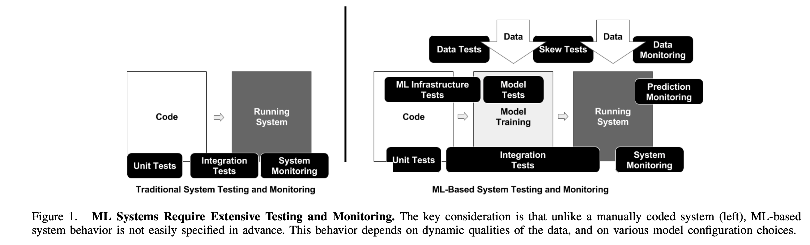
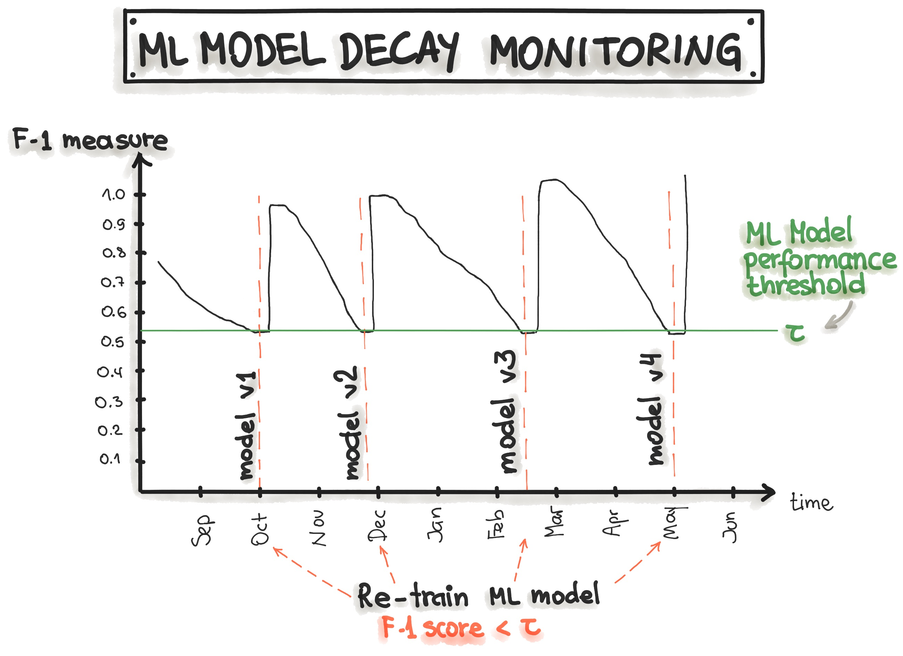

# MLOps principles

As machine learning and AI propagate in software products and services, we need to establish best practices and tools to test, deploy, manage, and monitor ML models in real-world production. In short, with MLOps we strive to avoid *"technical debt"* in machine learning applications. 

SIG MLOps defines *"an optimal MLOps experience [as] one where Machine Learning assets are treated consistently with all other software assets within a CI/CD environment. Machine Learning models can be deployed alongside the services that wrap them and the services that consume them as part of a unified release process."*
By codifying these practices, we hope to accelerate the adoption of ML/AI in software systems and fast delivery of intelligent software.
In the following, we describe a set of important concepts in MLOps such as *Iterative-Incremental Development, Automation, Continuous Deployment, Versioning, Testing, Reproducibility, and Monitoring*.

## Iterative-Incremental Process in MLOps

The complete MLOps process includes three broad phases of *"Designing the ML-powered application", "ML Experimentation and Development", and "ML Operations"*.

The first phase is devoted to *business understanding, data understanding* and *designing the ML-powered software*. In this stage, we identify our potential user, design the machine learning solution to solve its problem, and assess the further development of the project. Mostly, we would act within two categories of problems - either increasing the productivity of the user or increasing the interactivity of our application.

Initially, we define ML use-cases and prioritize them. The best practice for ML projects is to work on one ML use case at a time. Furthermore, the *design* phase aims to inspect the available data that will be needed to train our model and to specify the functional and non-functional requirements of our ML model. We should use these requirements to design the architecture of the ML-application, establish the serving strategy, and create a test suite for the future ML model. 

The follow-up phase *"ML Experimentation and Development"* is devoted to verifying the applicability of ML for our problem by implementing *Proof-of-Concept for ML Model*. Here, we run iteratively different steps, such as *identifying or polishing the suitable ML algorithm for our problem, data engineering*, and *model engineering*. The primary goal in this phase is to deliver a stable quality ML model that we will run in production.

The main focus of the *"ML Operations"* phase is to deliver the previously developed ML model in production by using established DevOps practices such as testing, versioning, continuous delivery, and monitoring.

All three phases are interconnected and influence each other. For example, the design decision during the design stage will propagate into the experimentation phase and finally influence the deployment options during the final operations phase.

## Automation

The level of automation of the Data, ML Model, and Code pipelines determines the maturity of the ML process. 
With increased maturity, the velocity for the training of new models is also increased.
The objective of an MLOps team is to automate the deployment of ML models into the core software system or as a service component.
This means, to automate the complete ML-workflow steps without any manual intervention.
Triggers for automated model training and deployment can be calendar events, messaging, monitoring events, as well as changes on data, model training code, and application code.

Automated testing helps discovering problems quickly and in early stages.
This enables fast fixing of errors and learning from mistakes.

To adopt MLOps, we see *three levels of automation*, starting from the initial level with manual model training and deployment, up to running both ML and CI/CD pipelines automatically.

1. **Manual process.**
   This is a typical data science process, which is performed at the beginning of implementing ML.
   This level has an experimental and iterative nature.
   Every step in each pipeline, such as data preparation and validation, model training and testing, are executed manually.
   The common way to process is to use Rapid Application Development (RAD) tools, such as Jupyter Notebooks.
2. **ML pipeline automation.**
   The next level includes the execution of model training automatically.
   We introduce here the continuous training of the model.
   Whenever new data is available, the process of model retraining is triggered.
   This level of automation also includes data and model validation steps.
3. **CI/CD pipeline automation.**
   In the final stage, we introduce a CI/CD system to perform fast and reliable ML model deployments in production.
   The core difference from the previous step is that we now automatically build, test, and deploy the Data, ML Model, and the ML training pipeline components.

The following picture shows the automated ML pipeline with CI/CD routines:

[Figure adopted from "MLOps: Continuous delivery and automation pipelines in machine learning"](https://cloud.google.com/solutions/machine-learning/mlops-continuous-delivery-and-automation-pipelines-in-machine-learning#top_of_page)

The MLOps stages that reflect the process of ML pipeline automation are explained in the following table:
<html lang="en" dir="ltr">
  <head>
    <meta charset="utf-8">
    <title></title>
  </head>
  <body>

   <table class="table table-striped">
    <thead>
      <th  class="table-head" scope="col">MLOps Stage</th>
      <th  class="table-head" scope="col">Output of the Stage Execution</th>
    </thead>
    <tr>
      <td class="tg-0lax">Development &amp; Experimentation (ML algorithms, new ML models)</td>
      <td class="tg-0lax">Source code for pipelines: Data extraction, validation, preparation, model training, model evaluation, model testing</td>
    </tr>
    <tr>
      <td class="tg-0lax">Pipeline Continuous Integration (Build source code and run tests)</td>
      <td class="tg-0lax">Pipeline components to be deployed: packages and executables.</td>
    </tr>
    <tr>
      <td class="tg-0lax">Pipeline Continuous Delivery (Deploy pipelines to the target environment)</td>
      <td class="tg-0lax">Deployed pipeline with new implementation of the model.</td>
    </tr>
    <tr>
      <td class="tg-0lax">Automated Triggering (Pipeline is automatically executed in production. Schedule or trigger are used)</td>
      <td class="tg-0lax">Trained model that is stored in the model registry.</td>
    </tr>
    <tr>
      <td class="tg-0lax">Model Continuous Delivery (Model serving for prediction)</td>
      <td class="tg-0lax">Deployed model prediction service (e.g. model exposed as REST API)</td>
    </tr>
    <tr>
      <td class="tg-0lax">Monitoring (Collecting data about the model performance on live data)</td>
      <td class="tg-0lax">Trigger to execute the pipeline or to start a new experiment cycle.</td>
    </tr>
  </table>

  </body>
  </html>

After analyzing the MLOps Stages, we might notice that the MLOps setup requires several components to be installed or prepared.
The following table lists those components:
<html lang="en" dir="ltr">
  <head>
    <meta charset="utf-8">
    <title></title>
  </head>
  <body>

   <table class="table table-striped">
      <thead>
        <th class="table-head" scope="col">MLOps Setup Components</th>
        <th class="table-head" scope="col">Description</th>
      </thead>
      <tr>
        <td class="tg-0pky">Source Control </td>
        <td class="tg-0pky">Versioning the Code, Data, and ML Model artifacts.</td>
      </tr>
      <tr>
        <td class="tg-0pky">Test &amp; Build Servises</td>
        <td class="tg-0pky">Using CI tools for (1) Quality assurance&nbsp;&nbsp;for all ML artifacts, and (2) Building packages and executables for pipelines.</td>
      </tr>
      <tr>
        <td class="tg-0pky">Deployment Servises</td>
        <td class="tg-0pky">Using CD tools for deploying pipelines to the target environment.</td>
      </tr>
      <tr>
        <td class="tg-0pky">Model Registry</td>
        <td class="tg-0pky">A registry for storing already trained ML models.</td>
      </tr>
      <tr>
        <td class="tg-0pky">Feature Store</td>
        <td class="tg-0pky">Preprocessing input data as features to be consumed in the model training pipeline and during the model serving.</td>
      </tr>
      <tr>
        <td class="tg-0pky">ML Metadata Store</td>
        <td class="tg-0pky">Tracking metadata of model training, for example model name, parameters, training data, test data, and metric results.</td>
      </tr>
      <tr>
        <td class="tg-0pky">ML Pipeline Orchestrator</td>
        <td class="tg-0pky">Automating the steps of the ML experiments.</td>
      </tr>
    </table>
                                                                   
</body>
</html>

Further reading: ["MLOps: Continuous delivery and automation pipelines in machine learning"](https://cloud.google.com/solutions/machine-learning/mlops-continuous-delivery-and-automation-pipelines-in-machine-learning#top_of_page)

## Continuous Deployment

To understand ***Model deployment***, we first specify the "ML assets" as ML model, its parameters and hyperparameters, training scripts, training and testing data. We are interested in the identity, components, versioning, and dependencies of these ML artifacts.
The target destination for an ML artifact may be a (micro-) service or some infrastructure components.
A deployment service provides orchestration, logging, monitoring, and notification to ensure that the ML models, code and data artifacts are stable.

## Versioning

The goal of the *versioning* is to treat ML training scrips, ML models and data sets for model training as first-class citizens in DevOps processes by tracking ML models and data sets with version control systems. The common reasons when ML model and data changes (according to [SIG MLOps](https://lists.cd.foundation/g/sig-mlops)) are the following:

- ML models can be retrained based upon new training data.
- Models may be retrained based upon new training approaches.
- Models may be self-learning.
- Models may degrade over time.
- Models may be deployed in new applications.
- Models may be subject to attack and require revision.
- Models can be quickly rolled back to a previous serving version.
- Corporate or government compliance may require audit or investigation on both ML model or data, hence we need access to all versions of the productionized ML model.
- Data may reside across multiple systems.
- Data may only be able to reside in restricted jurisdictions.
- Data storage may not be immutable.
- Data ownership may be a factor.

Analogously to the best practices for developing reliable software systems, every ML model specification (ML training code that creates an ML model) should go through a code review phase.
Furthermore, every ML model specification should be versioned in a VCS to make the training of ML models auditable and reproducible.

**Further reading:** How do we manage ML models? [Model Management Frameworks](https://www.inovex.de/blog/machine-learning-model-management/)

## Experiments Tracking

Machine Learning development is a highly iterative and research-centric process.
In contrast to the traditional software development process, in ML development, multiple experiments on model training can be executed in parallel before making the decision what model will be promoted to production.

The experimentation during ML development might have the following scenario:
One way to track multiple experiments is to use different (Git-) branches, each dedicated to the separate experiment.
The output of each branch is a trained model.
Depending on the selected metric, the trained ML models are compared with each other and the appropriate model is selected.
Such low friction branching is fully supported by the tool [DVC](https://dvc.org/), which is an extension of Git and an open-source version control system for machine learning projects.
Another popular tool for ML experiments tracking is the [Weights and Biases (wandb)](https://www.wandb.com/) library, which automatically tracks the hyperparameters and metrics of the experiments.

## Testing

[Figure source: "The ML Test Score: A Rubric for ML Production Readiness and Technical Debt Reduction" by E.Breck et al. 2017](https://static.googleusercontent.com/media/research.google.com/en//pubs/archive/aad9f93b86b7addfea4c419b9100c6cdd26cacea.pdf)

The complete development pipeline includes three essential components, **data pipeline**, **ML model pipeline**, and **application pipeline**. In accordance with this separation we distinguish three scopes for testing in ML systems:
 **tests for features and data**, **tests for model development**, and **tests for ML infrastructure**.

### Features and Data Tests

- Data validation: Automatic check for data and features schema/domain.
  - Action: In order to build a schema (domain values), calculate statistics from the training data.
  This schema can be used as *expectation definition* or *semantic role* for input data during training and serving stages.

- Features importance test to understand whether new features add a predictive power.
  - Action: Compute correlation coefficient on features columns.
  - Action: Train model with one or two features.
  - Action: Use the subset of features "One of *k* left out and train a set of different models.
  - Measure data dependencies, inference latency, and RAM usage for each new feature.
  Compare it with the predictive power of the newly added features.
  - Drop out unused/deprecated features from your infrastructure and document it.

- Features and data pipelines should be policy-compliant (e.g. GDPR).
These requirements should be programmatically checked in both development and production environments.

- Feature creation code should be tested by unit tests (to capture bugs in features).

### Tests for Reliable Model Development

We need to provide specific testing support for detecting ML-specific errors.

- Testing ML training should include routines, which verify that algorithms make decisions aligned to business objective.
This means that ML algorithm loss metrics (MSE, log-loss, etc.) should correlate with business impact metrics (revenue, user engagement, etc.)
  - Action: The loss metrics - impact metrics relationship, can be measured in small scale A/B testing using an intentionally degraded model.
  - Further reading: Selecting the Right Metric for evaluating Machine Learning Models. [here 1](https://medium.com/usf-msds/choosing-the-right-metric-for-machine-learning-models-part-1-a99d7d7414e4), [here 2](https://medium.com/usf-msds/choosing-the-right-metric-for-evaluating-machine-learning-models-part-2-86d5649a5428)

- Model staleness test.
The model is defined as *stale* if the trained model does not include up-to-date data and/or does not satisfy the business impact requirements.
Stale models can affect the quality of prediction in intelligent software.
  - Action: A/B experiment with older models.
  Including the range of ages to produce an *Age vs. Prediction Quality*  curve to facilitate the understanding of how often the ML model should be trained.
- Assessing the cost of more sophisticated ML models.
  - Action: ML model performance should be compared to the simple baseline ML model (e.g. linear model vs neural network).
- Validating performance of a model.
  - It is recommended to separate the teams and procedures collecting the training and test data to remove the dependencies and avoid false methodology propagating from the training set to the test set ([source](https://arxiv.org/pdf/2003.05155.pdf)).
  - Action: Use an additional test set, which is disjoint from the training and validation sets. Use this *test set* only for a final evaluation.

- Fairness/Bias/Inclusion testing for the ML model performance.
  - Action: Collect more data that includes potentially under-represented categories.
  - Action: Examine input features if they correlate with protected user categories.
  - Further reading: ["Tour of Data Sampling Methods for Imbalanced Classification"](https://machinelearningmastery.com/data-sampling-methods-for-imbalanced-classification/)

- Conventional unit testing for any feature creation, ML model specification code (training) and testing.

- Model governance testing (coming soon)

### ML infrastructure test

- Training of the ML models should be reproducible, that means that training the ML model on the same data should produce identical ML models.
  - Diff-testing relies on deterministic training, which is hard to achieve due to non-convexity of the ML algorithms, random seed generation, or distributed ML model training.
  - Action: reduce non-determinism.

- Test ML API usage. Stress testing.
  - Action: Unit tests to randomly generate input data and training the model for a single optimization step (e.g gradient descent).
  - Action: Crash tests for model training. The ML model should restore from a checkpoint after a mid-training crash.

- Test the algorithmic correctness.
  - Action: Unit test that it is not intended to completing the ML model training but to train for a few iterations and ensure that loss decreases while training.
  - Avoid: Diff-testing with previously build ML models because such tests are hard to maintain.

- Integration testing: The full ML pipeline should be integration tested.
  - Action: Create a fully automated test that regularly triggers the entire ML pipeline.
  The test should validate that the data and code successfully finish each stage of training and the resulting ML model performs as expected.
  - All integration tests should be run before the ML model reaches the production environment.

- Validating the ML model before serving it.
  - Action: Setting a threshold and testing for slow degradation in model quality over many versions on a validation set.
  - Action: Setting a threshold and testing for sudden performance drops in a new version of the ML model.

- ML models are *canaried* before serving.
  - Action: Testing that an ML model successfully loads into production serving and the prediction on real-life data is generated as expected.

- Testing that the model in the training environment gives the same score as the model in the serving environment.
  - Action: The difference between the performance on the holdout data and the “next­day” data.
  Some difference will always exist.
  Pay attention to large differences in performance between holdout and "next­day" data because it may indicate that some time-sensitive features cause ML model degradation.
  - Action: Avoid result differences between training and serving environments. Applying a model to an example in the training data and the same example at serving should result in the same prediction.
  A difference here indicates an engineering error.

## Monitoring

Once the ML model has been deployed, it need to be monitored to assure that the ML model performs as expected. The following check list for model monitoring activities in production is adopted from ["The ML Test Score: A Rubric for ML Production Readiness and Technical Debt Reduction" by E.Breck et al. 2017:](https://static.googleusercontent.com/media/research.google.com/en//pubs/archive/aad9f93b86b7addfea4c419b9100c6cdd26cacea.pdf)

- Monitor dependency changes throughout the complete pipeline result in notification.
  - Data version change.
  - Changes in source system.
  - Dependencies upgrade.
- Monitor data invariants in training and serving inputs: Alert if data does not match the schema, which has been specified in the training step.
  - Action: tuning of alerting threshold to ensure that alerts remain useful and not misleading.
- Monitor whether training and serving features compute the same value.
  - Since the generation of training and serving features might take place on physically separated locations, we must carefully test that these different code paths are logically identical.
  - Action: (1) Log a sample of the serving traffic.
  (2) Compute distribution statistics (min, max, avg, values, % of missing values, etc.) on the training features and the sampled serving features and ensure that they match.
- Monitor the numerical stability of the ML model.
  - Action: trigger alerts for the occurrence of any NaNs or infinities.
- Monitor computational performance of an ML system.
Both dramatic and slow-leak regression in computational performance should be notified.
  - Action: measure the performance of versions and components of code, data, and model by pre-setting the alerting threshold.
  - Action: collect system usage metrics like GPU memory allocation, network traffic, and disk usage. These metrics are useful for *cloud costs* estimations.
- Monitor how *stale* the system in production is.
  - Measure the *age* of the model.
  Older ML models tend to decay in performance.
  - Action: Model monitoring is a continuous process, therefore it is important to identify the elements for monitoring and create a strategy for the model monitoring before reaching production.
- Monitor the processes of feature generation as they have impact on the model.
  - Action: re-run feature generation on a frequent basis.
- Monitor degradation of the predictive quality of the ML model on served data.
Both dramatic and slow-leak regression in prediction quality should be notified.
  - Degradation might happened due to changes in data or differing code paths, etc.
  - Action: Measure statistical bias in predictions (avg in predictions in a slice of data).
  Models should have nearly zero bias.
  - Action: If a label is available immediately after the prediction is made, we can measure the quality of prediction in real-time and identify problems.

The picture below shows that the model monitoring can be implemented by tracking the precision, recall, and F1-score of the model prediction along with the time.
The decrease of the precision, recall, and F1-score triggers the model retraining, which leads to model recovery.

## "ML Test Score" System

The "ML Test Score" measures the overall *readiness* of the ML system for production. The final **ML Test Score** is computed as follows:

 + For each test, **half a point** is awarded for executing the test manually, with the results documented and distributed.
 + A **full point** is awarded if the there is a system in place to run that test automatically on a repeated basis.
 + Sum the score of each of the four sections individually: Data Tests, Model Tests, ML Infrastructure Tests, and Monitoring.
 + The final **ML Test Score** is computed by taking the minimum of the scores aggregated for each of the sections: Data Tests, Model Tests, ML Infrastructure Tests, and Monitoring.

After computing the **ML Test Score**, we can reason about the *readiness* of the ML system for production. The following table provides the interpretation ranges:

<html lang="en" dir="ltr">
  <head>
    <meta charset="utf-8">
    <title></title>
  </head>
  <body>

   <table class="table table-striped">
<thead>  
    <th>Points</th>
    <th>Description</th>  
</thead>
<tbody>
  <tr>
    <td>0</td>
    <td>More of the research project than a productionized system.</td>
  </tr>
  <tr>
    <td>(0,1]</td>
    <td>Not totally untested, but it is worth considering the possibility of serious holes in reliability.</td>
  </tr>
  <tr>
    <td>(1,2]</td>
    <td>There has been first pass at basic productionization, but additional investment may be needed.</td>
  </tr>
  <tr>
    <td>(2,3]</td>
    <td>Reasonably tested, but it is possible that more of those tests and procedures may be automated.</td>
  </tr>
  <tr>
    <td>(3,5]</td>
    <td>Strong level of automated testing and monitoring.</td>
  </tr>
  <tr>
    <td>&gt;5</td>
    <td>Exceptional level of automated testing and monitoring.</td>
  </tr>
</tbody>
</table>

</body>
</html>

[Source: "The ML Test Score: A Rubric for ML Production Readiness and Technical Debt Reduction" by E.Breck et al. 2017](https://static.googleusercontent.com/media/research.google.com/en//pubs/archive/aad9f93b86b7addfea4c419b9100c6cdd26cacea.pdf)

## Reproducibility

Reproducibility in a machine learning workflow means that every phase of either data processing, ML model training, and ML model deployment should produce identical results given the same input.

<html lang="en" dir="ltr">
  <head>
    <meta charset="utf-8">
    <title></title>
  </head>
  <body>

   <table class="table table-striped">
        <thead>
          <th class="tg-r0kq">Phase</th>
          <th class="tg-r0kq">Challenges</th>
          <th class="tg-0lax">How to Ensure Reproducibility</th>
        </thead>
        <tr>
          <td class="tg-0lax">Collecting Data</td>
          <td class="tg-0lax">Generation of the training data can't be reproduced  (e.g due to constant database changes or data loading is random)</td>
          <td class="tg-0lax">1) Always backup your data.   2) Saving a snapshot of the data set (e.g. on the cloud storage).   3) Data sources should be designed with timestamps so that a view of the data at any point can be retrieved.   4) Data versioning.</td>
        </tr>
        <tr>
          <td class="tg-0lax">Feature Engineering</td>
          <td class="tg-0lax">Scenarios:  1) Missing values are imputed with random or mean values.  2) Removing labels based on the percentage of observation.  3) Non-deterministic feature extraction methods.</td>
          <td class="tg-0lax">1) Feature generation code should be taken under version control.  2) Require reproducibility of the previous step "Collecting Data"</td>
        </tr>
        <tr>
          <td class="tg-0lax">Model Training / Model Build</td>
          <td class="tg-0lax">Non-determinism</td>
          <td class="tg-0lax">1) Ensure the order of features is always the same.  2) Document and automate feature transformation, such as normalization.  3) Document and automate hyperparameter selection.  4) For ensemble learning: document and automate the combination of ML models.</td>
        </tr>
        <tr>
          <td class="tg-0lax">Model Deployment</td>
          <td class="tg-0lax">1) Training the ML model has been performed with a software version that is different to the production environment.  2) The input data, which is required by the ML model is missing in the production environment.</td>
          <td class="tg-0lax">1) Software versions and dependencies should match the production environment.  2) Use a container (Docker) and document its specification, such as image version.  3) Ideally, the same programming language is used for training and deployment.</td>
        </tr>
      </table>

      </body>
      </html>

## Loosely Coupled Architecture (Modularity)

According to Gene Kim et al., in their book "Accelerate", *"high performance [in software delivery] is possible with all kinds of systems, provided that systems—and the teams that build and maintain them — are loosely coupled. This key architectural property enables teams to easily test and deploy individual components or services even as the organization and the number of systems it operates grow—that is, it allows organizations to increase their productivity as they scale."*

Additionally, Gene Kim et al., recommend to *"use a loosely coupled architecture. This affects the extent to which a team can test and deploy their applications on demand, without requiring orchestration with other services. Having a loosely coupled architecture allows your teams to work independently, without relying on other teams for support and services, which in turn enables them to work quickly and deliver value to the organization."*

Regarding ML-based software systems, it can be more difficult to achieve *loose coupling* between machine learning components than for traditional software components.
ML systems have weak component boundaries in several ways.
For example, the outputs of ML models can be used as the inputs to another ML model and such interleaved dependencies might affect one another during training and testing.

Basic modularity can be achieved by structuring the machine learning project.  To set up a standard project structure, we recommend using dedicated templates such as 

+ [Cookiecutter Data Science Project Template](https://drivendata.github.io/cookiecutter-data-science/)
+ [The Data Science Lifecycle Process Template](https://github.com/dslp/dslp-repo-template)
+ [PyScaffold](https://github.com/pyscaffold/pyscaffold)

## ML-based Software Delivery Metrics (4 metrics from "Accelerate")

In the most resent study on the [state of DevOps](https://services.google.com/fh/files/misc/state-of-devops-2019.pdf), the authors emphasized four key metrics that capture the effectivenes of the software development and delivery of elite/high performing organisations: *Deployment Frequency, Lead Time for Changes, Mean Time To Restore*, and *Change Fail Percentage*. These metrics have been found [useful](https://www.thoughtworks.com/radar/techniques/four-key-metrics) to measure and improve ones ML-based software delivery. In the following table, we give the definition of each of the metricts and make the connection to MLOps.

<html lang="en" dir="ltr">
  <head>
    <meta charset="utf-8">
    <title></title>
  </head>
  <body>

   <table class="table table-striped">
<thead>
  <tr>
    <th>Metric</th>
    <th>DevOps</th>
    <th>MLOps</th>
  </tr>
</thead>
<tbody>
  <tr>
    <td>Deployment Frequency</td>
    <td>How often does your organization deploy code to production or release it to end-users?</td>
    <td>ML Model Deployment Frequency depends on  1) Model retraining requirements (ranging from less frequent to online training). Two aspects are crucial for model retraining   1.1) Model decay metric.  1.2) New data availability.  2) The level of automation of the deployment process, which might range between *manual deployment* and *fully automated CI/CD pipeline*.</td>
  </tr>
  <tr>
    <td>Lead Time for Changes</td>
    <td>How long does it take to go from code committed to code successfully running in production?</td>
    <td>ML Model Lead Time for Changes depends on  1) Duration of the explorative phase in Data Science in order to finalize the ML model for deployment/serving.  2) Duration of the ML model training.  3) The number and duration of manual steps during the deployment process.</td>
  </tr>
  <tr>
    <td>Mean Time To Restore (MTTR)</td>
    <td>How long does it generally take to restore service when a service incident or a defect that impacts users occurs (e.g., unplanned outage or service impairment)?</td>
    <td>ML Model MTTR depends on the number and duration of manually performed model debugging, and model deployment steps. In case, when the ML model should be retrained, then MTTR also depends on the duration of the ML model training. Alternatively, MTTR refers to the duration of the rollback of the ML model to the previous version.</td>
  </tr>
  <tr>
    <td>Change Failure Rate</td>
    <td>What percentage of changes to production or released to users result in degraded service (e.g., lead to service impairment or service outage) and subsequently require remediation (e.g., require a hotfix, rollback, fix forward, patch)?</td>
    <td>ML Model Change Failure Rate can be expressed in the difference of the currently  deployed ML model performance metrics to the previous model's metrics, such as Precision, Recall, F-1, accuracy, AUC, ROC, false positives, etc. ML Model Change Failure Rate is also related to A/B testing.</td>
  </tr>
</tbody>
</table>

</body>
</html>

To improve the effectiveness of the ML development and delivery process one should measure the above four key metrics. A practical way to achieve such effectiveness is to implement the CI/CD pipeline first and adopt test-driven development for Data, ML Model, and Software Code pipelines. 

## Summary of MLOps Principles and Best Practices

The complete ML development pipeline includes three levels where changes can occur: ***Data***, ***ML Model***, and ***Code***.
This means that in machine learning-based systems, the trigger for a build might be the combination of a code change, data change or model change.
The following table summarizes the MLOps principles for building ML-based software:

<html lang="en" dir="ltr">
  <head>
    <meta charset="utf-8">
    <title></title>
  </head>
  <body>

   <table class="table table-striped">
<thead>
  <tr>
    <th>MLOps Principles</th>
    <th>Data</th>
    <th>ML Model</th>
    <th>Code</th>
  </tr>
</thead>
<tbody>
  <tr>
    <td>Versioning</td>
    <td>1) Data preparation pipelines  2) Features store  3) Datasets  4) Metadata</td>
    <td>1) ML model training pipeline  2) ML model (object)  3) Hyperparameters  4) Experiment tracking</td>
    <td>1) Application code  2) Configurations</td>
  </tr>
  <tr>
    <td>Testing</td>
    <td>1) Data Validation (error detection)  2) Feature creation unit testing</td>
    <td>1) Model specification is unit tested  2) ML model training pipeline is integration tested  3) ML model is validated before being operationalized  4) ML model staleness test (in production)  5) Testing ML model relevance and correctness  6) Testing non-functional requirements (security, fairness, interpretability)</td>
    <td>1) Unit testing  2) Integration testing for the end-to-end pipeline</td>
  </tr>
  <tr>
    <td>Automation</td>
    <td>1) Data transformation  2) Feature creation and manipulation</td>
    <td>1) Data engineering pipeline  2) ML model training pipeline  3) Hyperparameter/Parameter selection</td>
    <td>1) ML model deployment with CI/CD 2) Application build</td>
  </tr>
  <tr>
    <td>Reproducibility</td>
    <td>1) Backup data  2) Data versioning  3) Extract metadata  4) Versioning of feature engineering</td>
    <td>1) Hyperparameter tuning is identical between dev and prod  2) The order of features is the same  3) Ensemble learning: the combination of ML models is same   4)The model pseudo-code is documented </td>
    <td>1) Versions of all dependencies in dev and prod are identical  2) Same technical stack for dev and production environments   3) Reproducing results by providing container images or virtual machines 
    </td>
  </tr>
  <tr>
    <td>Deployment</td>
    <td>1) Feature store is used in dev and prod environments</td>
    <td>1) Containerization of the ML stack  2) REST API  3) On-premise, cloud, or edge </td>
    <td>1) On-premise, cloud, or edge</td>
  </tr>
  <tr>
    <td>Monitoring</td>
    <td>1) Data distribution changes (training vs. serving data)  2) Training vs serving features</td>
    <td>1) ML model decay  2) Numerical stability  3) Computational performance of the ML model</td>
    <td>1) Predictive quality of the application on serving data</td>
  </tr>
</tbody>
</table>

</body>
</html>

Along with the MLOps principles, following the set of best practices should help reducing the "technical debt" of the ML project:

<html lang="en" dir="ltr">
  <head>
    <meta charset="utf-8">
    <title></title>
  </head>
  <body>

   <table class="table table-striped">
<thead>
  <tr>
    <th>MLOps Best Practices</th>
    <th>Data</th>
    <th>ML Model</th>
    <th>Code</th>
  </tr>
</thead>
<tbody>
  <tr>
    <td>Documentation</td>
    <td>1) Data sources 2) Decisions, how/where to get data 3) Labelling methods</td>
    <td>1) Model selection criteria 2) Design of experiments 3) Model pseudo-code</td>
    <td>1) Deployment process 2) How to run locally</td>
  </tr>
  <tr>
    <td>Project Structure</td>
    <td>1) Data folder for raw and processed data 2) A folder for data engineering pipeline 3) Test folder for data engineering methods</td>
    <td>1) A folder that contains the trained model 2) A folder for notebooks 3) A folder for feature engineering 4)A folder for ML model engineering </td>
    <td>1) A folder for bash/shell scripts 2) A folder for tests 3) A folder for deployment files (e.g Docker files)</td>
  </tr>
</tbody>
</table>

</body>
</html>

