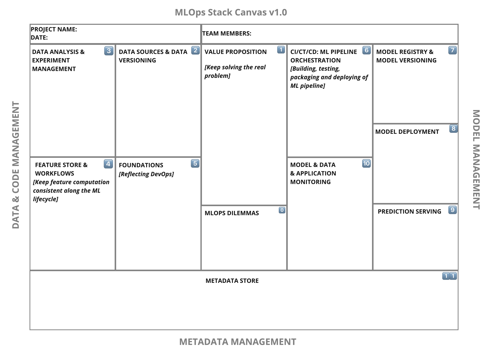
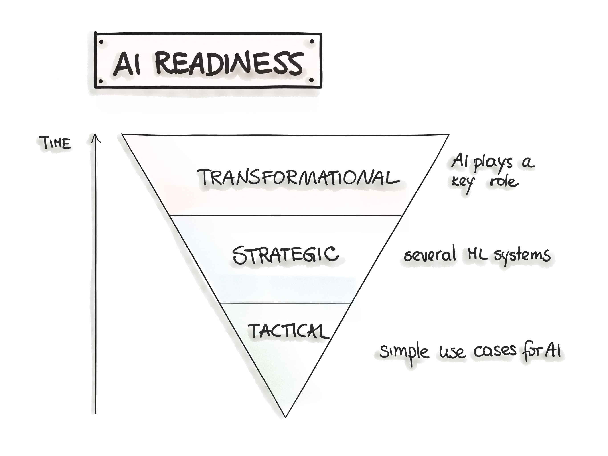

 

**Machine Learning Operations** (MLOps) defines language-, framework-, platform-, and infrastructure-agnostic practices to design, develop, and maintain machine learning applications. However, getting ML in production implies many interplaying components. Moreover, with the currently exploding number of MLOps platforms and frameworks, it is challenging to keep up with the development pace. One of the main issues for ML-adopters is technology integration and compatibility. 

According to the [current surveys](https://info.algorithmia.com/tt-state-of-ml-2021), 49% of organizations experience challenges with integrating their ML tooling, frameworks, and languages technology stack. The reason for this challenge is that ML technology is still evolving and is in its early stages. Additionally, the development of MLOps tooling is happening at a fast pace, making the adoption of such a fast-developing infrastructure difficult for getting ML-system into production sustainably.  

**To specify an architecture and infrastructure stack for Machine Learning Operations, we suggest a general MLOps Stack Canvas framework designed to be application- and industry-neutral.** We align to the [CRISP-ML(Q) model](https://ml-ops.org/content/crisp-ml) and describe the eleven components of the MLOps stack and line them up along with the ML Lifecycle and the [“AI Readiness”](https://services.google.com/fh/files/misc/ai_adoption_framework_whitepaper.pdf) level to select the right amount of MLOps processes and technlogy components. 

## MLOps Stack Canvas
The CRISP-ML(Q) provides a process - a set of steps that we will perform during the machine learning development life cycle. Another aspect of ML development is infrastructure components, such as tools, platforms, and frameworks needed for successful ML model operations (see Figure 1). 

Figure 1. Mapping the CRISP-ML(Q) process model to the MLOps stack.

Hence, building the infrastructure stack for MLOps is the next important part of the ML project. However, given a lack of standardization in the ML development process model and operations and the ever-growing number of tools, creating an infrastructure stack is an overwhelming exercise for many ML aspiring teams. Given the hype around MLOps tools, small teams with a small amount of data are getting the impression that MLOps solutions would require significant infrastructure investment. 

According to the [recent survey conducted by Algorithmia](https://info.algorithmia.com/tt-state-of-ml-2021), *“the second greatest ML challenge is technology integration and compatibility,”* which indicates that many organizations are still at the beginning of the ML life cycle. To support the understanding of your requirements for the ML system and the audit process of the infrastructure components, we suggest an MLOps Stack Canvas framework (see Figure 2). 

We envision the MLOps Stack Canvas as help to architect the ML system. Similar to the canonical Business Model Canvas, our canvas condenses the main elements of a whole technology stack for an ML application into a single page. This framework guides the development teams through the MLOps building blocks and lets them answer the MLOps infrastructure-related questions and identify the necessary tools chain. 

The purpose of the MLOps Stack Canvas is to help you to structure workflows, architecture, and infrastructure components for the MLOps stack in the ML project. The scope of MLOps Stack Canvas is the following:
+ Ensuring that ML model solutions have a (business) impact.
+ Planning the cost of the infrastructure components for the MLOps stack by considering three main areas:
    + Data and code management
    + ML model management, and 
    + Metadata management
+ Planning the cost of the orchestration of the ML system to manage its life-cycle and maintainability by considering 
    + Continuous integration/training/delivery for ML assets
    + Monitoring to ensure the ML is achieving the business objectives
    + Alerting to deal with model failures.
+ Designing the ML system to fulfill:
    + Reproducibility: versioning, feature store, and pipelines,
    + Reliability: models should have few outages and safe failovers, and
    + Efficiency: model predictions are fast and as cost-effective as possible.

Generally, the [MLOps Stack Canvas](https://miro.com/app/board/o9J_lfoc4Hg=/) consists of three main areas: *Data and Code Management, Model Management,* and *Metadata Management*. Each of these areas contains its own building blocks. 

Figure 2: MLOps Stack Canvas to identify the infrastructure components.

Please note that you might access the [MLOps Stack Canvas](https://miro.com/miroverse/mlops-stack-canvas/) as a Miro board and it is licensed under a Creative Commons Attribution-ShareAlike 4.0 International License.

In the following, we explain each of these blocks.

### Value Proposition

The central component in the MLOps Stack Canvas is the Value Proposition. Generally, a value proposition is a statement that outlines why a customer would benefit from using our software or service. We create awareness about pain points, and the problem is being solved. An ML system generates predictions that are a foundation for a later decision to increase productivity or improve user experience. Therefore, the ML system should create value for an end-user. The value proposition section summarizes the key things that make up your software product and why end-users should use it. The goal is to focus on solving the real problem. To create an effective Value Proposition statement, we could use Geoffrey Moore’s value positioning statement template:

*“For (target customer) who (need or opportunity), our (product/service name) is (product category) that (benefit).”*

We recommend applying the [Machine Learning Canvas](https://www.louisdorard.com/machine-learning-canvas) through the initial phase of the CRISP-ML(Q) process to achieve both the high-level prototype of the ML system and to specify the value proposition. This value proposition could then be re-used in the MLOps Stack Canvas. 
Another practical tool to specify the value proposition is [Value Proposition Canvas](https://www.peterjthomson.com/2013/11/value-proposition-canvas/). Generally, to formulate the value proposition for the ML project, we should answer the following questions:

 1. What are we trying to do for the end-user(s)?
 1. What is the problem?
 1. Why is this an important problem?
 1. Who is our persona? (ML Engineer, Data Scientist, Operation/Business user)
 1. Who owns the models in production?

### Data Sources and Data Versioning

Data is a fundamental part of machine learning. Hence, the next component, after articulating the business problem in Value Proposition, is “Data Sources and Data Versioning.” The overall goal is to estimate the cost of data acquisition, storage, and processing, which are the main activities during the Business and Data Understanding and Data Preparation phases of the CRISP-ML(Q). Dataset development and its further processing for ML algorithms, such as assigning labels to unlabeled data points, might be costly. Since we consider ML models and data as “first-class citizens,” data versioning might need to be implemented to analyze the model performance every time new data is available. 

In addition, data versioning might be a regulatory requirement to explain predictions for every version of the learned model. Generally, we distinguish three levels of data versioning as described in ["Machine Learning Engineering" by A.Burkov](http://www.mlebook.com/): 1) Data is versioned as a snapshot at training time; 2) Versioning data and code as one asset; 3) Using specialized data versioning systems. 

The following considerations in the “Data Sources and Data Versioning” component should be made:

 1. Is this data versioning optional or mandatory? E.g., is data versioning a requirement for a system like a regulatory requirement?
 1. What data sources are available? (e.g., owned, public, earned, paid data)
 1. What is the storage for the above data? (e.g., data lake, DWH)
 1. Is manual labeling required? Do we have human resources for it?
 1. How to version data for each trained model?
 1. What tooling is available for data pipelines/workflows?

Additionally to the current MLOps Stack Canvas, we recommend using the [Data Landscape Canvas](https://www.canvasgeneration.com/canvas/data-landscape/) to create an overview of the available, accessible, and required data sources for the ML project.

### Data Analysis and Experiment Management
As described in CRISP-ML(Q), the initial phase of the project concerns tasks to translate business objectives to ML tasks, to collect and understand data, and to assess the feasibility of the project. To achieve these tasks, we run experiments and implement a proof of concept. The “Data Analysis and Experiment Management” block’s focus is the applicability of the ML technology for the specified business goals and data preparation. Here, we should answer the following questions regarding tooling:  

 1. What programming language to use for analysis? (R, Python, Scala, Julia. Or is SQL sufficient for analysis?)
 1. Are there any infrastructure requirements for model training?
 1. What ML-specific and business evaluation metrics need to be computed?
 1. Reproducibility: What metadata about ML experiments is collected? (data sets, hyperparameters)
 1. What ML Framework know-how is there?

### Feature Store and Workflows
Being a crucial activity in machine learning, feature engineering is a process of transforming raw input data into feature vectors that are suitable input formats for machine learning algorithms before model training and prediction. The [motivation for the “Feature Store,”](https://eugeneyan.com/writing/feature-stores/) as a new component in the MLOps stack, is the need for management, reproducibility, discovery, and reuse of features across ML projects and various data science teams. A feature store is defined as an interface between data engineering and ML model engineering to separate the feature engineering from the CRISP-ML(Q) model development process. Feature stores promise the speed up in the development and operationalization of ML models. However, as an advanced component, feature stores might add complexity and its implementation need to be critically considered for every ML project: 
 1. Is this optional or mandatory? Do we have a data governance process such that feature engineering has to be reproducible?
 1. How are features computed (workflows) during the training and prediction phases?
 1. What are infrastructure requirements for feature engineering?
 1. "Buy or make" for feature stores?
 1. What databases are involved in feature storage?
 1. Do we design APIs for feature engineering?

### Foundations (Reflecting DevOps)

Related to almost every phase of the ML lifecycle, the next block in the MLOps Stack Canvas is about the inventory of the available DevOps infrastructure and raising awareness about the current DevOps principles in the ML project. The intuition behind this activity is that we might extrapolate DevOps best practices to the MLOps activities. However, suppose there are gaps in the traditional DevOps practices. In that case, we should improve them first before starting with more complex activities such as model and data versioning, continuous model training, or feature store. We, therefore, follow the guidelines of the [Accelerate State of DevOps Report](https://cloud.google.com/blog/products/devops-sre/the-2019-accelerate-state-of-devops-elite-performance-productivity-and-scaling) and execute a self-assessment for the software delivery performance by answering the following questions: 

 1. How do we maintain the code? What source version control system is used?
 1. How do we monitor the system performance? 
 1. Do we need versioning for notebooks?
 1. Is there a trunk-based development in place?
 1. Deployment and testing automation: What is the CI/CD pipeline for the codebase? What tools are used for it?
 1. Do we track [deployment frequency, lead time for changes, mean time to restore, and change failure rate metrics](https://ml-ops.org/content/mlops-principles#ml-based-software-delivery-metrics-4-metrics-from-accelerate)?

Following the DevOps principles has a direct impact on the software delivery performance. As MLOps build upon DevOps, establishing the stable DevOps culture for software projects is a prerequisite for successful ML projects.

### Continuous Integration, Training, and Deployment: ML Pipeline Orchestration

In the previous block, we reviewed the existing CI/CD pipelines for the software delivery. Since the core software and ML model might have different release cycles, we examine the continuous integration routine for the ML model release in this block. Additionally, we introduce a new practice such as Continuous Training (CT). 

Generally, continuous integration denotes the building, testing, and packaging of data and model pipelines. Continuous training is a new property, unique to ML systems concerned with automatically retraining ML models. We utilize the [pipeline pattern](https://learning.oreilly.com/library/view/machine-learning-design/9781098115777/ch08.html), a software design pattern that implements the construction and execution of a sequence of operations. Typically, data and ML pipelines include operations such as data verification, feature and data selection, data cleaning, feature engineering, and model training. The set of acyclic pipelines construct a directed acyclic graph (DAG) and denote the overall workflow job. Depending on the maturity level, we might want to automate the data and model training pipeline workflows to operationalize the model. We trigger data preparation and model training pipelines whenever the new data is available, or the source code for the pipeline has changed. In this block of the MLOps Stack Canvas, we should clarify the processes and the toolchain for CI/CT in the CRISP-ML(Q) Model Engineering phase:  

 1. How often are models expected to be retrained? What is the trigger for it (scheduled, event-based, or ad hoc)?
 1. Where does this happen (locally or on a cloud)?
 1. What is the formalized workflow for an ML pipeline? (e.g., Data prep -> model training -> model eval & validation) What tech stack is used?
 1. Is distributed model training required? Do we have an infrastructure for the distributed training?
 1. What is the workflow for the CI pipeline? What tools are used?
 1. What are the [non-functional requirements for the ML model](https://arxiv.org/pdf/1906.10742.pdf) (efficiency, fairness, robustness, interpretability, etc.)? How are they tested? Are these tests integrated into the CI/CT workflow?

### Model Registry and Model Versioning
The next block of MLOps Stack Canvas concerns the ML model registry and versioning component, which is an essential infrastructural part for the Model Evaluation phase in the CRISP-ML(Q) process. The machine learning model is an essential asset along with the data and the software code. Similar to code versioning in traditional software engineering, establishing a model and data versioning practice is the foundation for reproducibility in machine learning. Depending on your use case, a change in code or data might trigger a model re-training. 

The common reason for the machine learning model update is the “model decay,” where the model performance declines with time as new data arrives. All ML models should be versioned and protocolled in regulated industries such as health, finance, or military. At the same time, there might be a need to ensure backward compatibility by rolling back previously built models. Also, by tracking several versions of the ML model, it is possible to implement different deployment strategies such as “canary”- or “shadow”-deployment by analyzing the latest trained model's performance improvement. 
Hence, in this category, we answer the following questions:

 1. Is this optional or mandatory? The model registry might be mandatory if you have multiple models in production and need to track them all. The reproducibility requirement might be the reason that you need the model versioning.
 1. Where should new ML models be stored and tracked?
 1. What versioning standards are used? (e.g., semantic versioning)

Please note that as an advanced component, the ML model registry and versioning might be reasonable in the later stages of the ML projects.

### Model Deployment

After training and evaluation, we transit to the next phase of the CRISP-ML(Q) and deploy the ML model. Deploying an ML model denotes making it available on the target environment for receiving prediction requests. Continuous Deployment (CD) is an automatic deployment of ML models into the target environment based on predetermined evaluation metrics. In this section of the MLOps Stack Canvas, we specify all model exposure strategies and infrastructure aspects of CD by answering the following questions:

 1. What is the delivery format for the model?
 1. What is the expected time for changes? (Time from commit to production)
 1. What is the target environment to serve predictions?
 1. What is your model release policy? Is A/B testing or multi-armed bandits testing required? (e.g., for measuring the effectiveness of the new model on business metrics and deciding what model should be promoted into the production environment)
 1. What is your deployment strategy? (e.g. shadow/canary deployment required?)

### Prediction Serving

This block of the MLOps Stack Canvas deals with the ML model serving as a process of applying a machine learning model to the new input data. Generally, we distinguish between online and batch modes of prediction serving. They can be implemented using [five patterns](https://ml-ops.org/content/three-levels-of-ml-software#code-deployment-pipelines) to put the ML model in production: *Model-as-Service, Model-as-Dependency, Precompute, Model-on-Demand,* and *Hybrid-Serving*. Each of these patterns would require different infrastructure settings. For example, Model-as-Service implements a model serving as a distributed service for input requests via REST API and implies the on-demand modus for prediction responses. At the same time, the Precompute pattern means that the prediction modus is batch and the model predictions are precomputed and stored in a relational database. 

To identify the environment for model serving, we should answer the following questions in the Prediction Serving block of the MLOps Stack Canvas: 

 1. What is the serving mode? (batch or online)
 1. Is distributed model serving required?
 1. Is [multi-model prediction serving](https://www.oreilly.com/content/efficient-machine-learning-inference/) required?
 1. Is pre-assertion for input data implemented?
 1. What fallback method for an inadequate model output (post-assertion) is implemented? (Do we have a heuristic benchmark?)
 1. Do you need ML inference accelerators (TPUs)?
 1. What is the expected target volume of predictions per month or hours?

### ML Model, Data, and System Monitoring
Once the ML Model is deployed, it must be constantly monitored to ensure the model quality, meaning that the model serving produces correct results. This block of the MLOps Stack Canvas clarifies the monitoring part of running the ML System in production and relates to the sixth phase of the CRISP-ML(Q) process: 

 1. Is this optional or mandatory? For instance, do you need to assess the effectiveness of your model during prediction serving? Do you need to monitor your model for performance degradation and trigger an alert if your model starts performing badly? Is the model retraining based on events such as data or concept drift?
 1. What ML metrics are collected?
 1. What domain-specific metrics are collected?
 1. How is the model performance decay detected? (Data Monitoring)
 1. How is the data skew detected? (Data Monitoring)
 1. What operational aspects need to be monitored? (e.g., model prediction latency, CPU/RAM usage)
 1. What is the alerting strategy? (thresholds)
 1. What triggers the model re-training? (ad hoc, event-based, or scheduled)

### Metadata Store
Finally, we should specify an overlapping area such as metadata management. Metadata management is the management of information about each execution of the experiments, data and model pipeline is recorded to provide data and artifacts lineage, reproducibility, and debug errors. 

The Metadata Store is a cross-cutting component that spans all previous elements of the MLOps infrastructure stack. Depending on your organization and regulatory requirements, you might need to implement an ML model governance process. This process will mainly rely on ML metadata. Therefore, the requirement for ML governance is the ML metadata store component. In the last block of the MLOps Stack canvas, we answer the following questions:

 1. What kind of metadata in code, data, and model management need to be collected? (e.g., the pipeline run ID, trigger, performed steps, start/end timestamps, train/test dataset split, hyperparameters, model object, various statistics/profiling, etc.)
 1. Are any ML governance processes included in the MLOps lifecycle? What metadata will be required?
 1. What is the documentation strategy: Do we treat documentation as a code? (examples: [Datasheets for Datasets](https://arxiv.org/abs/1803.09010) and [Model Card for Model Reporting](https://arxiv.org/abs/1810.03993))
 1. What operational metrics need to be collected? E.g., time to restore, change fail percentage.

### 3 Dilemmas of MLOps
There are also organizational aspects of MLOps, which belong to the general discussion about building the ML projects’ infrastructure. 
 1. **Tooling**: Should we buy, use existing open-source or build in-house tools for any of the MLOps components? What are the risks, trade-offs, and impacts of each of the decisions?
 1. **Platforms**: Should we agree on one MLOps platform or create a hybrid solution? What are the risks, trade-offs, and impacts of each of the decisions?
 1. **Skills**: How expensive is it to either acquire or educate our own machine learning engineering talents?

The MLOps Stack Canvas scope is to assist you while identifying the workflows, architecture, and infrastructure components for the MLOps stack in the ML project. Answering questions in this canvas should get you a good estimation of costs that accompany your ML project in every phase.

### MLOps Maturity Level

Machine learning is still a new technology for many organizations. Launching ML-powered software solutions goes through three stages of [“AI Readiness”](https://services.google.com/fh/files/misc/ai_adoption_framework_whitepaper.pdf), which denotes a company’s maturity in incorporating AI into the business. The AI maturity can be distinguished between three phases: *Tactical, Strategic,* and *Transformational* (see Figure 3).

Figure 3: AI Readiness Phases.

The initial phase, known as **Tactical**, denotes that the organizations explore the capabilities of ML/AI technologies. The reasonable way is to start with non-critical use cases and short-term projects. While building a proof of concepts, we create an opinion about the applicability of machine learning. This phase’s focus is clearly on learning and understanding what value ML might generate. Furthermore, all processes are mainly manual because there is little to no MLOps infrastructure and ML skills are being developed.

The next phase, called **Strategic**, implies that business goals coordinate the amount of ML use cases and parts of the processes are automated. Typically, there are basic ML skills in the team and basic infrastructure to get ML models into production. The main distinction to the previous phase is utilizing pipelines for data preparation and model training. Additionally, the ML system provides end points, such as REST API, to expose ML models to the target application. Basic ML monitoring and alerting functionality are in place as well.

In the **Transformational** phase, organizations use ML to stimulate innovation. In this phase, ML is productionized as a fully automated process, which implies a sophisticated data platform, widely adopted common patterns for ML development, and CI/CT/CD practices . Usually, the ML expertise is a part of a cross-functional team to maintain the productionized model. Furthermore, organizations utilize advanced MLOps components, such as feature store, ML model and data versioning, and model monitoring and alerting to trigger model re-training.

In general, **the amount of MLOps practices and infrastructure components will depend on the organization’s ML-maturity described in the “AI Readiness” framework**. The suggested MLOps Stack Canvas might be aligned with the "AI Readiness" maturity level of an organization. It is reasonable to apply the MLOps Canvas starting from the second phase, "Strategic,” where the AI use cases are aligned to the business core domain and teams start utilizing pipelines, experiment workflows and dedicated APIs for exposing the ML model.

## Conclusion

Getting ML models in production involves many interplaying components. With the currently exploding number of MLOps platforms and frameworks, it is challenging to keep up with the industry’s development pace and create the right technical environment for ML projects. To specify an architecture and infrastructure stack for Machine Learning Operations, we reviewed the CRISP-ML(Q) development lifecycle and suggested an application- and industry-neutral *MLOps Stack Canvas*. This Canvas helps identify the workflows, architecture, and infrastructure components for the MLOps stack in the ML project. Answering questions in the canvas should get a reasonable estimation of required components and its costs in the ML project.

## Acknowledgements

We would like to thank [Alexey Grigoriev](https://www.linkedin.com/in/agrigorev/) and [Louis Dorard](https://www.linkedin.com/in/louisdorard/) for the insightful discussions and their valuable feedback for this chapter.

