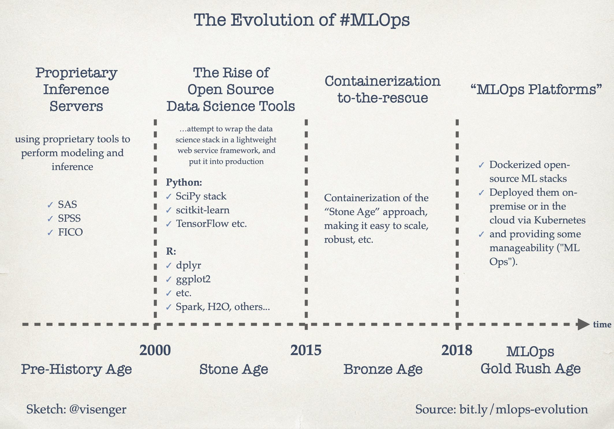

# Why you might want to use Machine Learning 

According to [Statista Digital Economy Compass 2019](https://cdn.statcdn.com/download/pdf/DigitalEconomyCompass2019.pdf), two major trends will disrupt the economy and our lives:
 - **Data-driven** world, due to the exponentially-growing amount of digitally-collected data.
 - The increasing importance of **Artificial Intelligence / Machine Learning / Data Science**, which derives insights from this tremendous amount of data.

ML/AI is rapidly adopted by new applications and industries.
Yet building successful ML-based software projects is still difficult.
Machine Learning Model Operationalization Management - **MLOps**, as a DevOps extension, establishes effective practices and processes around designing, building, and deploying ML models into production.

For the sake of consistency, we will use the term *machine learning (ML)*, however, the concepts and definitions apply to both *artificial intelligence* and *data science* fields.

Being a powerful tool, machine learning can solve many practical problems.
Like with any other software tools, we would need to identify the "right" nail (use-case or problem) to use this "hammer" (machine learning algorithms).

We are interested in including machine learning into software systems because ML might solve the following problems.
For example, *Perceptive problems* in conversational UIs can be solved with techniques such as *speech recognition* or *sentiment analysis*.
However, Machine learning (deep learning) appears to be the most appropriate one because such problems have a large number of elements with different representations. 
Another type of problems, suitable for ML, are multi-parameters problems.
For example, we apply machine learning approaches to generate a *stock prices* prediction, which is a foundation for a *stock trading* decisions.
Some problems can be too complex to be solved traditionally, and a probabilistic (stochastic) solution, implemented by using machine learning, might be the right way to pursue (e.g. spam filter, product recommendation, or fraud detection).  

Every machine learning pipeline is a set of operations, which are executed to produce a model.
A ML model is roughly defined as a mathematical representation of a real-world process.
We might think about ML model as a function that takes some input data and produces an output (classification, sentiment, recommendation, or clusters).
The performance of each model is evaluated by using evaluation metrics, such as *precision & recall*, or *accuracy*.

Placing models into production means making your models available to the software systems.
Practically, the ML model can enrich our software by providing the following features:

 * *Recommendation*, which identifies the relevant product in a large collection based on the product description or user’s previous interactions.
 * *Top-K Items Selection*, which organizes a set of items in a particular order that is suitable for a user (e.g. search result).
 * *Classification*, which assigns the input examples to one of previously defined classes (e.g *"spam"/"not spam"*).
 * *Prediction*, which assigns some most probable value to an entity of interest, such as stock value.
 * *Content Generation*, to produce new content by learning from existing examples, such as finishing a Bach chorale cantata by learning from his former compositions.
 * *Question Answering*, which answers an explicit question for example: “Does this text describe this image?”
 * *Automation*, which can be a set of user steps performed automatically, such as stock trading
 * *Fraud and Anomaly Detection*, to identify an action or transaction being a fraud or suspicious
 * *Information Extraction and Annotation*, to identify important information in a text, such as people's names, job descriptions, companies, and locations.

# Deployment gap 

More and more enterprises are experimenting with ML models.
Getting a model into the real world involves more than just building it.
In order to take full advantage of the built ML model by making it available to our core software system, we would need to incorporate the trained ML model into the core codebase.
That means, we need to deploy the ML model into production.
By deploying models, other software systems can supply data to these and get predictions, which are in turn populated back into the software systems.
Therefore, the full advantage of ML models is only possible through ML model deployment.

However, according to a report by Algorithmia ["2020 State of Enterprise Machine Learning"](https://info.algorithmia.com/hubfs/2019/Whitepapers/The-State-of-Enterprise-ML-2020/Algorithmia_2020_State_of_Enterprise_ML.pdf?utm_campaign=The%20Batch&utm_source=hs_email&utm_medium=email&utm_content=80984419&_hsenc=p2ANqtz--sz-e2gfqUeDvVSmjsXfvwOnLHB2ZkSdQsO1IRRAdnBIb0emf-JTh8NnwFxB-FeZberIw7_rI9ERTy8zFW8jvoTzjOfA&_hsmi=80984419), many companies haven't figured out how to achieve their ML/AI goals.
Because bridging the gap between ML model building and practical deployments is still a challenging task.
There’s a fundamental difference between building a Jupyter notebook model and experimenting with it, and deploying a ML model into a production system that generates business value.
Although AI budgets are on the rise, only [22 percent of companies](https://designingforanalytics.com/resources/failure-rates-for-analytics-bi-iot-and-big-data-projects-85-yikes/) that use machine learning have successfully deployed a ML model into production.

[Figure Source](https://algorithmia.com/state-of-ml?utm_medium=website&utm_source=interactive-page&utm_campaign=IC-1912-2020-State-of-ML&_hsenc=p2ANqtz-_WbXKYLnpgf4zi4OZTNYmNgCRPIFFEqmW-Cqi2Px_T1K2wkIJvDt7KdCxB5vXAPmGirLi7ukZTykxeUh9vmHdn7dRF9g&_hsmi=81660946)

The ["2020 State of Enterprise Machine Learning"](https://info.algorithmia.com/hubfs/2019/Whitepapers/The-State-of-Enterprise-ML-2020/Algorithmia_2020_State_of_Enterprise_ML.pdf?utm_campaign=The%20Batch&utm_source=hs_email&utm_medium=email&utm_content=80984419&_hsenc=p2ANqtz--sz-e2gfqUeDvVSmjsXfvwOnLHB2ZkSdQsO1IRRAdnBIb0emf-JTh8NnwFxB-FeZberIw7_rI9ERTy8zFW8jvoTzjOfA&_hsmi=80984419) report is based on a survey of nearly 750 people including machine learning practitioners, managers for machine learning projects, and executives at tech firms.
Half of the respondents answered that their company takes between a week and three months to deploy a ML model.
About 18 percent stated that it takes from three months to a year.
According to the report *"The main challenges people face when developing ML capabilities are scale, version control, model reproducibility, and aligning stakeholders"*.

# Scenarios of change that need to be managed

The reason for the previously described deployment gap is that the development of the machine learning-based applications is fundamentally different from traditional software.
The complete development pipeline includes three levels of change: **Data**, **ML Model**, and **Code**.
This means that in machine learning-based systems, the trigger for a build might be the combination of a code change, or data change or model change. This is also known as [*"Changing Anything Changes Everything"* principle](https://papers.nips.cc/paper/5656-hidden-technical-debt-in-machine-learning-systems.pdf). 

In the following, we list some scenarios of possible changes in machine learning applications:

 * After deploying the ML model into a software system, we might recognize that as time goes by, the model starts to decay and to behave abnormally, so we would need new data to re-train our ML model. 
 * After examining the available data, we might recognize that it's difficult to get the data needed to solve the problem we previously defined, so we would need to re-formulate the problem.
 * In the ML project at some stages, we might go back in the process and either collect more data, or collect different data and re-label training data. This should trigger the re-training of the ML Model. 
 * After serving the model to the end-users, we might recognize that the assumptions we made for training the model are wrong, so we have to change our model.
 * Sometimes the business objective might change while project development and we decide to change the machine learning algorithm to train the model.

Additionally, there are three common issues that influence the value of ML models once they’re in production. 

The first is ***data quality***: since ML models are build on data, they are sensitive to the semantics, amount and completeness of incoming data.

The second is ***model decay***: the performance of ML models in production degenerate over time, because of changes in the real-life data that has not been seen during the model training.

The third is ***locality***: when transferring ML models to new business customers, these models, which were pre-trained on different user demographics, might not work correctly. 

Since ML/AI is expanding into new applications and shaping new industries, building successful ML projects remains a challenging task.
As shown, there is a need to establish effective practices and processes around designing, building, and deploying ML models into production - MLOps.

#### Further reading:
 + [Why is DevOps for Machine Learning so Different?](https://hackernoon.com/why-is-devops-for-machine-learning-so-different-384z32f1)

# MLOps Definition

We saw what real-world problems might be solved by applying machine learning. 
We established the challenges of getting the ML models into production.

Finally, we are set up to define the term **MLOps**:

The term MLOps is defined as *“the extension of the DevOps methodology to include Machine Learning and Data Science assets as first class citizens within the DevOps ecology”* [Source: MLOps SIG](https://lists.cd.foundation/g/sig-mlops).

Alternatively, we can use the definition of  **Machine Learning Engineering (MLE)**, where *MLE is the use of scientific principles, tools, and techniques of machine learning and traditional software engineering to design and build complex computing systems. MLE encompasses all stages from data collection, to model building, to make the model available for use by the product or the consumers."* (by A.Burkov).

MLOps, like DevOps, emerges from the understanding that separating the ML model development — from the process that delivers it — ML operations — lowers quality, transparency, and agility of the whole intelligent software.

# The Evolution of the MLOps

Previously, before 2000, if businesses needed to implement machine learning solutions, they would use the vendors' licensed software such as SAS, SPSS, and FICO. With the rise of open-source software and the availability of data, more software practitioners started using Python or R libraries for training ML models. However, the usage of the models in production was still a problem. With the emergence of containerization technology, the deployment of the model in a scalable way was solved by using Docker containers and Kubernetes. Recently, we see the evolution of those solutions into ML deployment platforms that cover the whole iteration of model experimentation, training, deployment, and monitoring. The following Figure visualizes the evolution of the MLOps.

