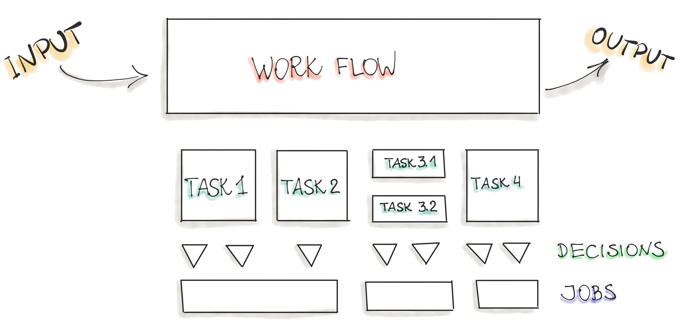
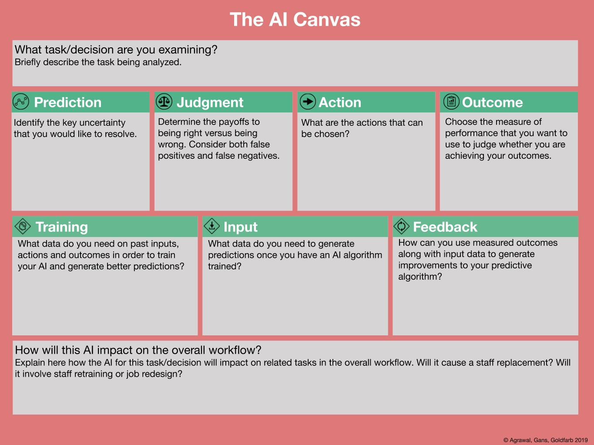
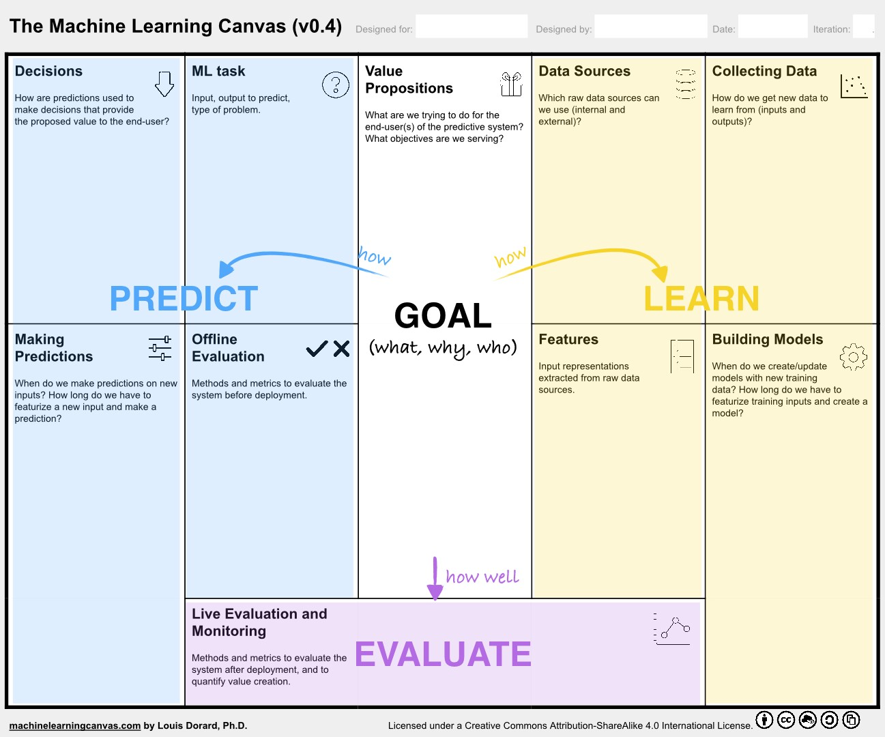

# “What is the business problem that we are trying to solve here?”

The most important phase in any software project is to understand the business problem and create requirements.
ML-based software is no different here.
The initial step includes a thorough study of business problems and requirements. 
These requirements are translated into the model objectives and the model outputs. Possible errors and minimum success for launching need to be specified. The most useful question to continue working on the AI/ML solution is ***"how costly are wrong predictions?"*** Answering that question will define the feasibility of the ML project.

## Work Flow Decomposition

Each task of the entire business process needs to be decomposed into its constituent elements in order to see where prediction (ML model) can be introduced.

To anwer the question *"how to implement AI/ML"*, we follow the next steps:

1. Identify the concrete ***process*** that might be powered by AI/ML (see the Figure above). 
2. Decompose that process into a directed graph of ***tasks***.
3. Identify where humans can be removed from the task, meaning, what task can be replaced by a prediction element such as ML model?
4. Estime the ROI for implementing an AI/ML tool to perform each task.
5. Rank-order the AI/ML implementation for each ***task*** in terms of ROI.
6. Start from the top of the list and structure the AI/ML implementation by completing either the *AI Canvas* or the *Machine Learning Canvas*.

The *AI Canvas* assists and helps to structure the breakdown process. It also helps to articulate exactly what is needed to predict and how we react on errors made by the prediction algorithm.

The *AI Canvas* was proposed by A. Agrawal et. al in their book *"Prediction Machines. The Simple Economics of Artificial Intelligence." 2018*, and "is an aid for contemplating, building, and assessing AI tools". The example of such canvas and the description of each component is provided in the Figure below:

[Figure Source](https://hbr.org/2018/04/a-simple-tool-to-start-making-decisions-with-the-help-of-ai)

## Machine Learning Canvas

While the above AI canvas represents a high-level structure of the ML/AI implementation, at some point we would like to specify both the vision for the ML system and the specifics of the system. To achieve those goals there is another tool, the *Machine Learning Canvas*, as suggested by [Louis Dorard](https://www.louisdorard.com/). This canvas structures the ML project and helps to specify the core requirements to realise the project. Initially, we identify the objective by answering a question *what do we want to achieve for the end-users of the predictive system?* Next, we connect the business goal to the ML task. 

The central part of the canvas is the *Value Proposition* building block, which describes products or services that create some value for customers. Typically, we answer the following questions: *What* problems are we trying to solve? *Why* is it important? *Who* is the end-user of our system? What value does the ML project deliver to the end-user? How will they use your outputs/predictions? 

The remaining canvas is divided into three broad categories: *Learning, Prediction,* and *Evaluation*. The Learning category is responsible to specify how the ML model will be learned. The Prediction part describes how the prediction is performed. Finally, the Evaluation category contains methods and metrics for the ML model and the system evaluation. The following machine learning canvas is an example provided by [Louis Dorard](https://www.louisdorard.com/): 

In total, the Machine Learning Canvas is structured as ten compound blocks, such as *Value Proposition, Data Sources, ML Task, Features (Engineering), Offline Evaluation, Decisions, Making Predictions, Collecting Data, Building Models,* and  *Live Evaluation and Monitoring*. Each of those blocks is focused on one aspect of the future ML application:

### Value Proposition
This is the crucial blocks in the whole canvas. Here we should answer three important questions:

1. *What* is the problem? What objective are we serving? What are we trying to do for the end-user? 
2. *Why* is it important?
3. *Who* is the end-user? Can we specify the *persona*?

[*Narrowing the domain*](https://cdixon.org/2015/02/01/the-ai-startup-idea-maze) of the problem could be useful for the next question regarding the required data. For example, instead of creating a universal chat-bot, build a bot that helps with scheduling conference-calls. 

### Data Sources
In this block, we clarify all available and possible data sources to be used for the ML task. As an example, we might consider using:

 + Internal/external databases.
 + REST APIs to gather data.
 + Static files.
 + Web scraping.
 + The output of other (ML) systems.
 + Open-source data sets.
   + Useful publicly available datasets: [Kaggle Datasets](https://www.kaggle.com/datasets), [Google's Dataset Search](https://datasetsearch.research.google.com/ ), [UCI Repository](https://archive.ics.uci.edu/ml/datasets.php), or [Wikipedia's list of datasets for machine-learning research](https://en.wikipedia.org/wiki/List_of_datasets_for_machine-learning_research)

Furthermore, we should clarify the *hidden costs* of a machine learning application.

 + How expensive could get the data storage?

### ML Task
After clarifying what data is available, we brainstorm what type of ML should be used. Here are some examples of questions that might clarify the ML Task:

 + Supervised or unsupervised learning?
 + Is this anomaly detection?
 + Is the problem about which option should be taken? (recommendation)
 + Do we need to predict a continous value? (regression)
 + Which category need to be predicted? (classification)
 + Do we need to group our data? (clustering)
 + If supervised, what type of ML task should be taken: classification, regression, or ranking?
 + If classification, will it be binary- or multiclass classification task?
 + What is the input for a prediction task? 
    + e.g. E-mail text.
 + What is the output of the prediction task?
    + e.g. "spam" and "regular"
 + What is the degree of complexity our ML Model could assume?
    + e.g. is our model a combination of other ML models? Do we employ ensemble learning? How many hidden layers included in the deep learning model?
 + What are the complexity costs, such as training and inference time, for the above models?
     
### Features (Engineering)

As every ML algorithm requires input data in the form of features, we should clarify how should the input data be represented. 

 + How do we extract features from raw sources? 
 + Consider to include domain experts to specify what data aspects are most important for the particular ML task.

### Offline Evaluation

Before any implementation of the ML model training, we would need to specify and set up the methods and metrics to evaluate the system before deployment. Here we would need to specify:

 + What evaluation metrics should be used?
    + Precision, Recall, F-1 measure.
    + Accuracy.
 + What is the meaning of model prediction errors such as *false positives* and *false negatives*?
 + What is our test data?
 + How much test data do we need to be confident that the ML model performs well?

### Decisions

After completing the ML task, Feature engineering, and the evaluation details, the next is to specify: 

+ How are prediction used to make decisions?
+ How does the end-user or the system interacts with the model predictions?
    + e.g. What happens if the user gets a list of product recommendations? What happens if the incoming e-mail is classified as "spam"?
+ Are there *hidden costs* in decision making, such as *human in the loop*?

Such information is required to later decide on how to deploy the ML model.

### Making Predictions

This block includes information about when we make a prediction on new inputs. 

+ When should predictions be available? 
   + New predictions are made each time when the user opens the app, such as recommendations.
   + New predictions are made on request.
   + New predictions are made on schedule.
+ Are predictions made *on the fly* for each data point or for a *batch* of the input data?
+ How computationally complex could the *model inference* get in the application?
+ Is there a *human in the loop* to support in making predictions?

### Collecting Data

Related to the *Making Predictions*, the *Collecting Data* block gathers information about new data that should be collected in order to re-train the ML model. In this way, we specify how we prevent the *ML model decay* phenomenon. Further questions to answer in this block are:

 + How do we label the new data?
 + How expensive is it to collect new data?
 + How expensive is it to process rich media like images, sound, or video?
 + Is there *human in the loop* for the manual cleaning and labelling of the incoming data?

### Building Models
Tightly related to the previous block, the *Building Models* answers questions regarding updating the ML models, because different ML tasks require different frequencies of model re-training:

 + How often the model should be retrained?
    + e.g. hourly, weekly, or with every new data point.
 + What are the *hidden costs* for model re-training?
    + e.g. do we use cloud resources to perform such tasks? 
    + what is the price policy of the cloud vendor?
    + how should we perform hardware cost estimation?
    + common *Cloud Pricing Calculators* are [Google Cloud Calculator](https://cloud.google.com/products/calculator), [Amazon ML Pricing](https://docs.aws.amazon.com/machine-learning/latest/dg/pricing.html),[ Microsoft Azure Calculator](https://azure.microsoft.com/en-in/pricing/calculator/)
 + How long will it take to re-train the model?
 + How do we deal with the scaling issues of cloud operations as they can be more complex and costly?
 + Do we plan for change in the tech stack?
    + e.g. how can we deal with the tech stack evolution as new tools and development workflows are emerging in the modern AI?

### Live Evaluation and Monitoring
After deployment, the ML model should be evaluated and here we would need to specify both *model* and *business* metrics, which should correlate. Generally, the metrics should follow the *S.M.A.R.T* methodology and be: *Specific, Measurable, Achievable, Relevant,* and *Time-bound*. 

 + How do we track the system performance?
    + e.g. A/B Testing
 + How do we evaluate the value creation? 
    + e.g users spent less time on the inbox.

The deliverable in this stage is the completed Machine Learning Canvas. The effort to fill out this canvas might initiate an existential discussion regarding the *real objective* and *hidden costs* for the ML-software. Such a discussion might result in a decision not to implement AI/ML at all.

#### Further reading

 + ["What is THE main reason most ML projects fail?"](https://towardsdatascience.com/what-is-the-main-reason-most-ml-projects-fail-515d409a161f)
 + [The New Business of AI (and How It’s Different From Traditional Software)](https://a16z.com/2020/02/16/the-new-business-of-ai-and-how-its-different-from-traditional-software/)

