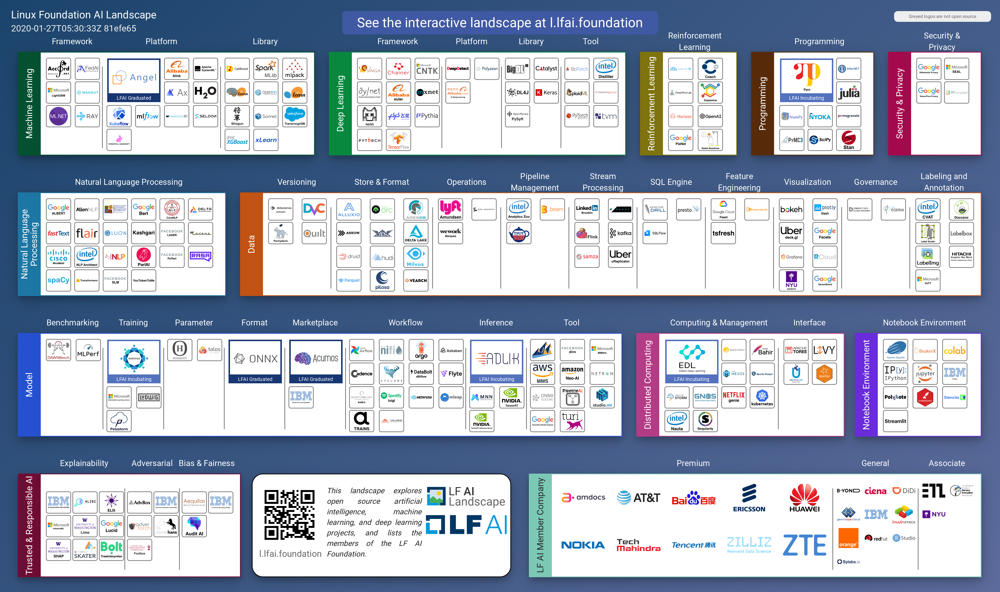

# MLOps Infrastructure Stack

Before any machine learning model can be put in production, many experimentation cycles are needed to identify the right ML model to achieve the business goal. 
This experimentation phase adds additional complexity in any ML project because it includes three main artifacts: **Data**, **Model**, and **Code**.
To manage this complexity, we need well-defined structures, processes, and proper software tools that manage ML artifacts and cover the machine learning cycle.

***MLOps must be language-, framework-, platform-, and infrastructure-agnostic practice. MLOps should follow a "convention over configuration" implementation.***

The MLOps technology stack should include tooling for the following tasks:
 - data engineering, 
 - version control of data, ML models and code,
 - coninuous integration and continuous delivery pipelines, 
 - automating deployments and experiments, 
 - model performance assessment, and 
 - model monitioring in production.

To solve MLOps challenges there are many choices ranging from using an *off-the-shelf machine-learning platform* to implement an in-house solution by composing open-source libraries. Existing cloud providers already working on offering machine learning platforms such as AI Platform by Google Cloud, AzureML, and SageMaker by AWS. Initiated at Google, the Kubeflow project presents an option to manage a set of open-source tools for MLOps and assemble them on Kubernetes. The adoption of such ML platform depends on the cloud strategy of the organization. In case, when an in-house hosted solution for MLOps is preferred, non-cloud systems like [MLFlow](https://mlflow.org/), [Sacred](https://github.com/IDSIA/sacred), or [DVC](https://dvc.org/) might be a tool of choice.   

Currently, the landscape of MLOps technologies is frequently changing. As the scope of each tool might span several components of the MLOps process, every use-case would require to consider the MLOps tech stack carefully.  For example, the requirements for model versioning and monitoring might be different depending on the use-case. Monitoring model serving in the regulated industries such as financial or medical will be more sophisticated than in a non-regulated. The structured way to proceed in the MLOps tech stack selection is to use the MLOps Stack Template.  This template breaks down a machine learning workflow into nine components, as described in the *MLOps Principles*. Before selecting tools or frameworks, the corresponding requirements for each component need to be collected and analysed. Finally, the tool selection should be aligned to that analysis.

The following MLOps Stack Template is courtesy of [Henrik Skogström (Valohai)](https://valohai.com/blog/the-mlops-stack/) 

An example of the technology stack might include the following open source tools:

<html lang="en" dir="ltr">
  <head>
    <meta charset="utf-8">
    <title></title>
  </head>
  <body>

   <table class="table table-striped">
<thead>
  <tr>
    <th>MLOps Setup Components</th>
    <th>Tools</th>
  </tr>
</thead>
<tbody>
<tr>
    <td>Data Analysis</td>
    <td>Python, Pandas</td>
  </tr>
  <tr>
    <td>Source Control</td>
    <td>Git</td>
  </tr>
  <tr>
    <td>Test &amp; Build Services</td>
    <td>PyTest &amp; Make</td>
  </tr>
  <tr>
    <td>Deployment Services</td>
    <td>Git, DVC</td>
  </tr>
  <tr>
    <td>Model &amp; Dataset Registry</td>
    <td>DVC[aws s3]</td>
  </tr>
  <tr>
    <td>Feature Store</td>
    <td>Project code library</td>
  </tr>
  <tr>
    <td>ML Metadata Store</td>
    <td>DVC</td>
  </tr>
  <tr>
    <td>ML Pipeline Orchestrator</td>
    <td>DVC &amp; Make</td>
  </tr>
</tbody>
</table>

</body>
</html>

Depending on the requirements or restrictions, organizations can implement their own in-house MLOps system by combining existing open-source libraries. To build such a system one should have an overview of the MLOps tool landscape. This landscape is rapidly developing and changing on a daily basis because different tools specialise in different niches. The [Linux Foundation’s LF AI](https://landscape.lfai.foundation/) project created a visualization for the ML/AI and MLOps tools. Another curated list of the production machine learning tools is maintained by the [Institute for Ethical AI](https://github.com/EthicalML/awesome-production-machine-learning).

[Figure Source](https://landscape.lfai.foundation/)

### Further References About the Technical Stack for MLOps

 + [Awesome Production Machine Learning: Toos and Frameworks](https://github.com/EthicalML/awesome-production-machine-learning)
 + [MLOps Agile Stack](images/mlops-agile-stack.png)
 + [Demystifying the AI Infrastructure Stack](https://www.intel.com/content/www/us/en/intel-capital/news/story.html?id=a0F1I00000BNTXPUA5#/type=All/page=0/term=/tags=)
 + [Introducing TWIML’s New ML and AI Solutions Guide](https://twimlai.com/solutions/introducing-twiml-ml-ai-solutions-guide/)
 + [MLOps.community resources](https://mlops.community/learn/)
