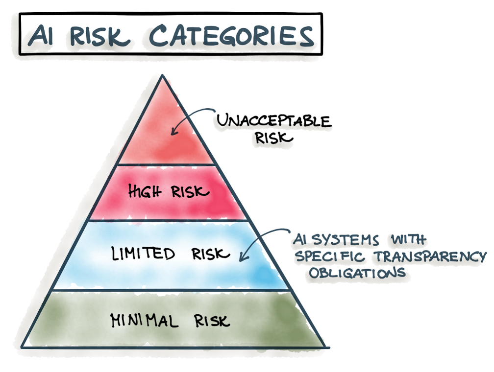
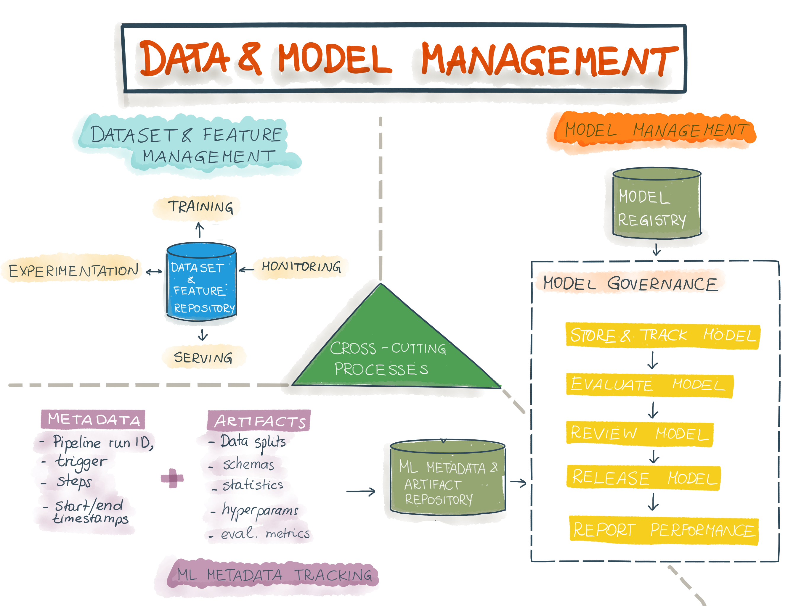

 

# MLOps and Model Governance

MLOps and Model Governance are often perceived as separate processes, but they are strongly interrelated. Therefore, we introduce the integration of these frameworks and explain the most important principles and technical components of MLOps and ML model governance.

1. Model Governance- A New Challenge
2. AI in Germany
3. Model Governance Will Not Be Optional
4. The Integration of Model Governance and MLOps
5. Summary – The Main Components of Model Governance

Recently, [Machine Learning Operations (MLOPs)](https://www.innoq.com/de/articles/2020/10/mlops-operations-fuer-machine-learning/) has received a lot of attention as it promises to bring machine learning (ML) models into production quickly, effectively, and for the long term. MLOps is equivalent to DevOps in software engineering: it is an extension of DevOps for the design, development, and sustainable deployment of ML models in software systems. Model Governance encompasses a set of processes and frameworks that help in the deployment of ML. Setting up automatized and reproducible data and ML pipelines reduces the amount of time required to bring models into production (time-to-market). There are six interactive phases in the ML development process:

- Business and Data Understanding
- Data Engineering
- Model Engineering
- Quality Assurance for ML Systems
- Deployment
- Monitoring and Maintenance

This figure shows the most important phases of the ML life cycle according to [CRISP-ML(Q)](https://arxiv.org/pdf/2003.05155.pdf):

Fig. 1: CRISP-ML(Q) process model

However, the operationalization of ML models is not the only challenge many companies are facing today. The use of MLobliges companies responsibility and compliance with legal requirements. To fulfill these obligations, a company requires processes through which it is able to:

- control access to ML models
- put guidelines and legal requirements into practice
- track interactions with the ML models and their results
- document the foundation of an ML model (stakeholders, business context, training data, feature selection, guidelines for model reproduction, choice of parameters, results of model evaluation and validation)
Collectively, these processes are referred to as *[Model Governance](https://www.datarobot.com/blog/what-is-model-governance/)*. 
 
 
## Model Governance - A New Challenge

Organizations often don’t recognize the importance of Model Governance until models are supposed to be deployed. Many companies have automatized  ML pipelines but fail to bring models into compliance with legal requirements. [According to an *Algorithmia*-Study](https://www.artificialintelligence-news.com) from 2021, 56 percent of respondents considered the implementation of model governance to be one of the biggest challenges for successfully bringing ML applications into production. In Germany, this [*IDG Research Services ML 2021 study*](https://www.lufthansa-industry-solutions.com/de-de/studien/idg-studie-machine-learning-2021) found that 26.2 percent of companies believe that compliance risks pose the biggest challenge, while  35.8 percent consider legal considerations (such as transparency of algorithmic decision-making) to be a remaining difficulty. 

## AI in Germany

According to this [*2021 Machine Learning study*](https://www.lufthansa-industry-solutions.com/de-en/studies/idg-study-machine-learning-2021), 73 percent of organizations with more than 10,000 employees and 59 percent of smaller companies use ML. ML is used in industries like IT (76%), production (57%), research and development (54.1%), logistics (52.9%), and sales (50.6%). Examples of use cases are quality assurance in production (53.8%), error reduction (43.8%), the automation of processes (40.2%), automatized case management (36.7%), optimization of the supply chain (34.9%), chatbots (30.2%), route optimization (30.2%), predictive maintenance (29.6%), customer self-service (29.6%), and intelligent product development (29.6%). For all of these domains and applications, organizations must implement MLOps to deploy ML models and build model governance frameworks to ensure models comply with regulations. 

## Model Governance Will Not Be Optional

Companies already have to comply with [several legal regulations](https://www.lufthansa-industry-solutions.com/de-de/studien/idg-studie-machine-learning-2021?gclid=Cj0KCQjw18WKBhCUARIsAFiW7JyBopj392wCTvucZ2vWlUqEFXl5pVuj1eVrgMs7YT3i5foYy-iMYuIaAgO5EALw_wcB#download). In addition, these requirements are expected to be expanded by AI-specific regulations: the EU published a [regulation draft in April 2021](https://digital-strategy.ec.europa.eu/en/policies/european-approach-artificial-intelligence) as the first legal framework for AI. [The draft takes an approach that classifies different types of AI systems according to four distinct risk categories](https://ec.europa.eu/info/strategy/priorities-2019-2024/europe-fit-digital-age/excellence-trust-artificial-intelligence_de). The risk category determines the scope of the regulations: the higher the determined risk, the more requirements have to be met:

Fig. 2: Different risk categories according to EU draft on AI regulation

### Category 1 (“Unacceptable Risk”)

AI software considered to be a significant risk for security, livelihoods, and human rights is forbidden (e.g., social scoring systems).

### Category 2 (“High Risk”)

AI software in the "high" risk category is subject to strict requirements. [These include the following aspects](https://germany.representation.ec.europa.eu/news/fur-vertrauenswurdige-kunstliche-intelligenz-eu-kommission-legt-weltweit-ersten-rechtsrahmen-vor-2021-04-21_de): Robustness, security, accuracy (precision), documentation and logging as well as appropriate risk assessment and mitigation. [Further requirements](https://planit.legal/das-ki-gesetz-der-eu-entwurf-und-diskussionsstand/) include high-quality training data, non-discrimination, traceability, transparency, human monitoring, and the need for conformity testing and proof of compliance through CE marking. Examples of ML systems in this category include private and public services (credit scoring) or systems used in education or vocational training to decide on a person's access to education and career path (e.g., exam scoring).

### Category 3 (“Limited Risk”)

This AI software is subject to a transparency obligation. For example, chatbot users must be informed that they are interacting with AI software.

### Category 4 (“Minimal Risk”)

AI software in this category is not subject to any regulation (e.g., spam filters).

As the regulation is supposed to apply not only to EU-based companies but also to any company offering AI services within the EU, [the law would have a similar scope of application as the GDPR](https://planit.legal/das-ki-gesetz-der-eu-entwurf-und-diskussionsstand/). [The regulation must be approved by the EU Parliament and pass through the legislative procedures of the individual member states](https://www.taylorwessing.com/de/insights-and-events/insights/2021/04/eine-neue-europaeische-regulierung-fuer-kuenstliche-intelligenz). If the law enters into force in 2024, [high-risk systems will have to undergo conformity assessment](https://ec.europa.eu/info/strategy/priorities-2019-2024/europe-fit-digital-age/excellence-trust-artificial-intelligence_en) before deployment. After passing the conformity assessment, the AI system can be registered in an EU database and receive a declaration of conformity, which is required to obtain the necessary CE marking. 

However, the [EU draft still has room for improvement](https://planit.legal/das-ki-gesetz-der-eu-entwurf-und-diskussionsstand/). The definition of an AI system is probably the biggest challenge in this context. This definition is blurry and might lead to different interpretations. Companies could be struggling to align their technical work with definitions in the regulation as the general character of the draft makes it unclear how the definitions, evaluation criteria and requirements will have to be put into practice. 
It is also important to note that EU regulations are not the only decisive argument for embracing model governance. Model governance is also relevant for low-risk ML not operating in a regulated domain, but which are related to high business risks. For example, if a company sells spam filters that regularly legitimate emails, its market position might be at risk due to this malfunction. As a result, model governance is not only needed to meet legal requirements, but also to ensure the quality of ML systems.

## The Integration of Model Governance and MLOps

The integration of MLOps and model governance depends on two aspects:

**Strength of the regulations – determined by the business domain, the risk category of an ML model, and the business risk**

There are industries with a long tradition of strict regulations, such as the health or finance sectors. Upcoming EU regulations might add new requirements to these domains, but they could also apply to non-regulated domains if the system is considered to be of high risk. Finally, the influence of AI systems on business success is crucial: if commercial success is heavily dependent on AI systems, management requirements should be correspondingly strict.

**Number of ML models that need to be integrated into the software systems**

The number of ML models shows two aspects. First, it reveals how strongly a company integrates ML into its main business domain and/or how organizationally and technically mature the company is for implementing the planned ML projects. Thus, a low number of ML models can either mean that ML does not play an important role in a company's business concept or that companies are not yet sufficiently equipped to implement ML. 

Fig. 3 shows the integration of model governance and MLOps along the degree of regulation and the number of models as Venn diagrams:

Fig. 3: The integration of MLOps and Model Governance, displayed as Venn diagrams. The higher the degree of regulation, the closer the integration. The more models we have, the bigger the importance of MlOps becomes

### Variant 1: Many Models and Strict Regulation

This scenario, where we see many models operating in a highly regulated application domain, is the most complex case.  Model governance and MLOps are equally important here and should be closely related to each other – model governance should be integrated into every step of the MLOps life cycle (development, deployment, and operations).

**Examples: Which Domains Are Subject to Strict Regulation?**

Models used in the healthcare and financial sectors are examples of models operating in strictly regulated domains. However, EU law might also apply to models of the high-risk category, even though they are not being applied in traditionally regulated fields. For example, high-risk systems could be ML systems that support process automation in critical infrastructure, but also models that automate human decision-making in order to determine access to vocational and school education.

**Framework for Model Governance**

It is important to integrate model governance processes into every step of the ML life cycle from the very beginning. The following [Model Governance framework](https://www.oreilly.com/library/view/the-framework-for/9781098100483/ch01.html) guides through the whole life cycle and covers both legal and corporate requirements.

This table describes the main components of the framework for model governance which should be integrated into every stage of the ML life cycle:

<html lang="en" dir="ltr">
  <head>
    <meta charset="utf-8">
    <title>MLOps-Model Governance-Framework</title>
  </head>
  <body>

   <table class="table table-striped">
<thead>
  <tr>
    <th>ML Lifecycle</th>
    <th>Model Governance Components</th>
    <th>Tasks and Artifacts</th>
  </tr>
</thead>
<tbody>
  <tr>
    <td>Development (building the training pipeline) </td>
    <td>Reproducibility,   Validation</td>
    <td>Model Metadata Management, Model Documentation, Model and Data Registry  
    Model Evaluation and Validation</td>

  </tr>
  <tr>
    <td>Deployment & Operations </td>
    <td>Observation, Visibility, Control </td>
    <td>Logging (Serving Logs),   Continuous Monitoring and Evaluation,   ML Infrastructure Cost Transparency, Versioning of Models and Data Sets   Tracking ML-Metadata in ML Metadata and Artifact Registry

</td>
  </tr>
  <tr>
    <td></td>
    <td>Monitoring and Alerting</td>
    <td>Continuous Monitoring and Continous Evaluation, Automated Alert Function (in response to performance loss or distribution shifts) </td>
  </tr>
  <tr>
    <td></td>
    <td>Model Service Catalog</td>
    <td>Providing requested information on models for internal reusability</td> 
  </tr>
  <tr>
    <td></td>
    <td>Security</td>
    <td>Data, Information and Infrastructure Security,  Compliance with IT standards,   Authentication, SSO and RBAC,   Management of Model Endpoints and API,   Management of Keys and Secrets, System Testing
</td>
  </tr>
  <tr>
    <td></td>
    <td>Conformity and Auditability</td>
    <td> Collecting relevant information from Model Logging (ML metadata), Documentation, Audit Results, Conformity Testing and certificate of conformity (CE Mark)
  </tr>
  <tr>
    
  </tr>
</tbody>
</table>

</body>
</html>

## Reproducibility and Validation

In the first phase of the ML lifecycle, **reproducibility must be established and the model should be validated**.

**Reproducibility** is the ability to obtain the same result twice. Similar to scientists precisely specifying experimental procedures, ML reproducibility must provide **relevant metadata** and information to reproduce models. **Model metadata management** includes the type of algorithm, features and transformations, data snapshots, hyperparameters, performance metrics, verifiable code from source code management, and the training environment.

**Documentation** is a commonly required part in regulated domains. However, the project itself also benefits from good documentation within the company as transparency and traceability minimize the risks of [*technical debt*](https://static.googleusercontent.com/media/research.google.com/en//pubs/archive/aad9f93b86b7addfea4c419b9100c6cdd26cacea.pdf). Documentation includes the following aspects: an explanation of the business context, a high-level explanation of the algorithm, model parameters, selection and definition of features,  instructions for reproducing the model, and examples for training the algorithms as well as examples for making predictions by the algorithm. Documentation can be supported by useful toolkits such as [*Data Sheets*](https://arxiv.org/pdf/1803.09010.pdf) and [*Model Cards*](https://arxiv.org/pdf/1810.03993.pdf). Data Sheets record which kind of mechanisms or procedures were used for data collection or whether ethical review procedures took place. Model Cards complement Data Sheets and provide information about the development of a model,  the assumptions that have been made, and expectations about model behavior across different cultural, demographic, or phenotypic groups.

The **validation ** of ML models is a multi-stage process with different metrics, such as performance indicators like accuracy or F1 score, or business metrics like KPIs to check for statistically significant improvement compared to a control group in A/B testing. KPIs can also be used to test whether the ML problem itself is properly formulated. In addition, the development team should check whether the model can be reproduced. 
Another important component of validation is explainability: are developers able to explain how individual features affect a prediction? Often, explanations for models can only be approximated.

After model deployment, model governance processes should be integrated into the deployment and operations phases of the ML lifecycle:

## Observation, Security, Control

This component enables companies to provide transparency about the model which includes **logging, metrics and auditing**: model logging values are processed into metrics and visualized in dashboards for analysis and communication purposes. **Cost transparency** provides visibility into costs and facilitates billing of various teams for a specific model and resource usage. **Model Usage Reports** provide visibility into the success and adoption of individual models and can support access control. The last component includes *versioning of model and data*, to ensure that all models can be restored without data loss or modification and that model prediction can be traced back to the model version that has produced them.

## Monitoring and Alerting

Key metrics should be continuously monitored to detect deviations early. If deviations, such as distribution shifts or performance loss are detected, alerts should be sent to inform stakeholders immediately (if MLOps-pipelines are fully automated, deviations will automatically trigger the CI/CD training pipeline). The monitoring engine requires appropriate platform and infrastructure integration with dashboard and monitoring tools, continuous monitoring of uptime SLA as a metric for application stability and availability, and alerting functionalities when problems occur. 

## Model Service Catalog

The Model Service Catalog is an internal marketplace of all ML models in the enterprise. The catalog should have a good UX, it should be connected to the location of model storage, and it should display relevant metadata for a model such as its latest version, inputs, and outputs. Employees with appropriate permissions can access the catalog, search for models, and retrieve requested information about the models.

## Security 

[ML security](https://www.innoq.com/de/articles/2021/08/machine-learning-security-teil-2/) is an important aspect of the model governance agenda. [This study](https://www.gartner.com/en/documents/3939991) by Gartner estimates that by 2022 thirty percent of cyber security attacks will have an ML-specific character.
To be protected against these attacks, measures must be taken to meet required security standards. For example, making models accessible through HTTP comes with the concurrent risk of misuse.  Therefore, adherence to IT standards (DNS, proxies, and load balancing for data traffic) is very important. However, the complexity of these standards may require the services of third-party providers. 

ML security management needs to secure and manage endpoints to make sure that only authorized users can create, change, or delete endpoints. Authentication, SSO, and role-based access control (RBAC) are further important aspects of ML security. ML models must be integrated into token-based authentication solutions to make sure that only eligible users are able to query the model. In addition, key and secret management should provide solutions for creating, saving, and managing keys. Finally, models are supposed to pass security audits. Therefore, it is very recommendable to involve IT and company experts from the beginning of a project to fully consider all security requirements.

Protection against ML-specific cybersecurity attacks is also very important. With models often being trained on sensitive data, **data and information security** play an important role. Using this [Adversarial ML Threat Matrix](https://github.com/mitre/advMLthreatmatrix) might be helpful: it is comparable to the classic Attack Chain Modeling and builds on the well-established [MITRE Att&CK](https://attack.mitre.org/), a globally accessible knowledge base of attacks and techniques. MITRE Att&CK is used as a guideline for the development of specific threat models and methods in the private sector, in governments, and in the field of cyber security products and services. The Adversarial ML Threat Matrix is a similar concept for ML security – it contains a collection of known weaknesses and the associated attacks.

## Conformity and Auditability 

Models of the high-risk category are supposed to undergo [conformity testing in order to be eligible to receive the CE marking](https://planit.legal/das-ki-gesetz-der-eu-entwurf-und-diskussionsstand/), which is a prerequisite to placing models on the European market. In order to fulfill the compliance and auditability requirements of a heavily regulated domain, the model governance framework should be as automated, transparent, and complete as possible. **Model logging, metrics, and audits** are very important in order to prove compliance with requirements. This includes collected and visually prepared model information, for example displaying metrics in dashboards, model and data versioning, and audit results (tested components of the validation in the development phase). Compliance with security requirements is another prerequisite for passing conformity testing: permissions, authorized access to ML applications and authentications have to be put into place. 
Each domain is subject to different regulations, and there is no one-size-fits-it-all solution. Compliance is very complex and often requires years of expertise. This makes it even more important to involve compliance and security experts in the model governance strategy from the very beginning to make sure that important considerations are not being overlooked. 

### Variant 2: Many Models and Little Regulation

This variant applies if the application domain is not highly regulated, the ML model is not in a high-risk category, and the associated business risk is low. In this case, companies need MLOps and model governance to manage and operationalize models. With legal requirements being weaker and the focus on MLOps being stronger than in the first variant, model governance forms part of MLOps and is not a stand-alone framework, unlike in the variant presented previously. 
To understand how model governance can be integrated into MLOps, an overview of MLOps is helpful. [This *Google* paper *"Practitioners guide to MLOps: A framework for continuous delivery and automation of machine learning*](https://services.google.com/fh/files/misc/practitioners_guide_to_mlops_whitepaper.pdf) divides MLOps into six integrated and iterative processes: ML Development, Training Operationalization, Continuous Training, Model Deployment, Prediction Serving, Continuous Monitoring, and Data and Model Management. We rely on this MLOps framework to demonstrate the integration of model governance and MLOps for the second variant (many models and low regulation).

Ideally, the result of the ML development should not be the model, but the formalization of the training pipeline (which encompasses the data- and model-engineering pipeline). When the monitoring machine detects dropping performance or distribution shifts, a trigger kicks off the (continuous) training pipeline: the model is re-trained with new data and then re-deployed. The training pipeline consists of a data engineering component (data entry, data validation, data transformation) and a model component (model training, model evaluation, model validation) and should be versioned and tested as well.
As a first step in the training, new training data are loaded from the data repository. Data and feature repositories standardize the definition and saving of the data, ensure data consistency for training and inference, and support data preprocessing and feature engineering processes. The data pass through all steps of the data engineering process and are then used to retrain the model. After model training, the model is evaluated, validated, and saved as a new model candidate in the model registry. 
All metadata and artifacts that are being produced during the training run are saved in the ML metadata and artifact repository. ML artifacts include statistics and data schemas, trained models, and metrics. ML metadata are the information about these artifacts (pipeline run ID, trigger, process type, start and end time, status, environmental configurations, and input parameter values).

Model registries manage the life cycle of ML models. After being registered,  model governance processes check whether the model candidate is ready to be deployed into the productive system (model deployment). After successful deployment, the model provides predictions for every input (prediction serving). Model governance permanently monitors the performance of the productive system (continuous monitoring) and collates all relevant metrics in an independent report (e.g. accuracy). As a result of the monitoring, performance drops or changing input data are immediately diagnosed, an alert is being sent, and/or the CI/CD training pipeline is triggered to produce a new model candidate. 

Figure 4 gives an overview shows how data and model management are implemented as cross-cutting processes in the MLOps life cycle:

Fig. 4: Data and model management are cross-purpose processes in the MLOps life cycle

## Model Governance as Part of Model Management 

Model governance encompasses the **recording, auditing, validation, approval, and monitoring of models**. In this variant, model governance is the final supervisory authority to approve a model for being deployed into the production environment. The list below summarizes the model governance components with the necessary tasks and artifacts. For the implementation of these tasks, model governance uses information from the ML metadata, the artifact repository, and the model registry.

- Storage/Versioning of models
- Evaluation and Explainability
- Testing
- Release
- Report (summary, visualization, highlighting of metrics) for quality assurance of the productive model

The model registry saves all model versions to ensure reproducibility and accountability (similar to the model versioning in the “observation and control of model governance” component).

The evaluation of a model is very important as well. To evaluate a model candidate, it can be released using shadow deployment. Then, its performance can be compared to the current productive model by comparing performance and business metrics (similar to the validation of the development phase).

Model audits are another fundamental aspect. Any model changes must be checked and approved to control risks in different categories (for example business, financial, legal, security, data protection, reputational, and ethical risks) as described in this end-to-end framework for the internal auditing of algorithms. The auditing component in this model governance framework can be considered to be a less strict variant of the certificate of conformity. Finally, a report contains the summary, visualization, and highlighting of model performance metrics collected during the monitoring process.

### Variant 3: Few Models and Little Regulation

This variant applies to companies that use ML models in non-regulated industries which do not belong to the high-risk category according to the EU draft and where the business risk is quite low. The low number of ML models can either mean that ML does not play an important role in the business strategy of the company or that the company is still in the early stage of AI maturity.

With a limited scope of regulations and a low number of models, companies do not have to consider too many aspects. The lack of requirements and the low number of models allows model governance to be optional, although it is still recommended to use it for quality assurance. The components of the development phase are also relevant for this scenario.

### Variant 4: Few Models and Strict Regulation

This scenario applies to companies operating in strictly regulated industries that are only using a small number of models. The only difference to variant 1 is the low number of models, which makes MLOps less important for this use case. However, the close integration of model governance frameworks with MLOps remains the same: in heavily regulated domains, model governance must cover the complete MLOps life cycle, even if only a few models are in use (see variant 1).

## Summary – The Main Components of Model Governance

Although the strength of regulation and the number of models determine how model governance should be implemented, all variants have the following aspects in common:

- Comprehensive model documentation or reports. This includes the report of metrics by using appropriate visualization techniques and dashboards
- Versioning of all models to create transparency for stakeholders (explainability and reproducibility)
- Auditing of ML systems (automated approval auditing or CE certification as part of conformity testing)
- Comprehensive data documentation to guarantee high data quality and adherence to data protection
- Management of ML metadata
- Validation of ML models
- Continuous monitoring and logging of model metrics

## Conclusion

We show that the compliance of ML systems with legal requirements is by no means an abstract problem, but one that can be solved technically because MLOps already provides the right infrastructure on which we can build on to implement model governance processes. Moreover, it should be clear that we need MLOps as well as Model Governance to successfully deploy ML models. 

